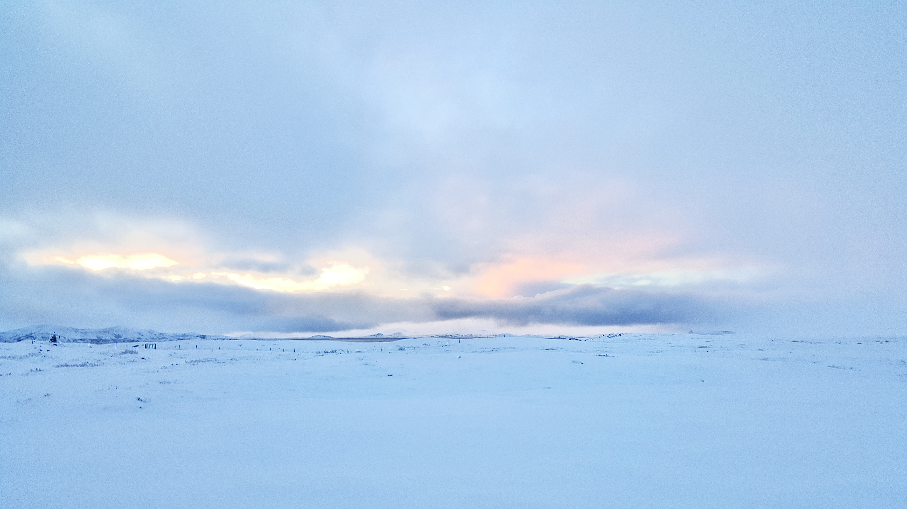
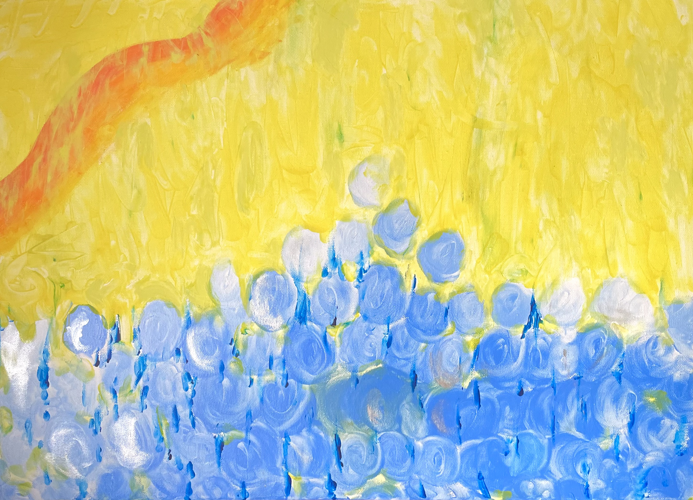

# 🪬 About

Hi, My name is Ziming Shang.&#x20;

I studied Fashion Business Management. Working as a tattooist for five years, and also working for sound designing, music production and music performance ;)

<figure><figcaption></figcaption></figure>

Place I had lived that made a influence:

Chengdu, China || San Antonio, TX, US || New York, US || Florence, Italy || Barcelona, Spain ||

```
// Feelings and Earth influence me to create.
```

Creation media:

Tattoos, Music, Painting, Movement, Traveling.

<figure><figcaption></figcaption></figure>

<figure><figcaption></figcaption></figure>

<figure><figcaption></figcaption></figure>



```
Music is free, I can be whatever I want with no limitations
 
Multi-possibilitiese with expression
```

<figure><figcaption></figcaption></figure>

<figure><figcaption></figcaption></figure>



