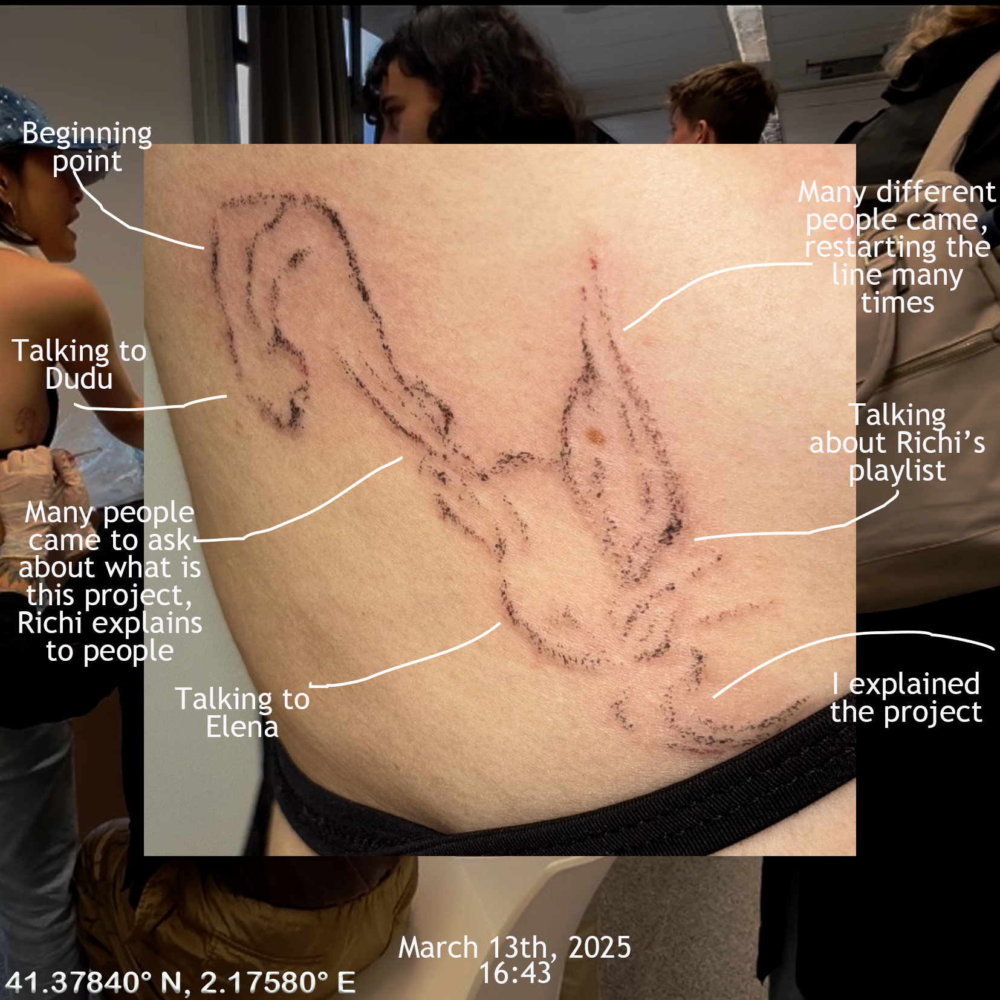
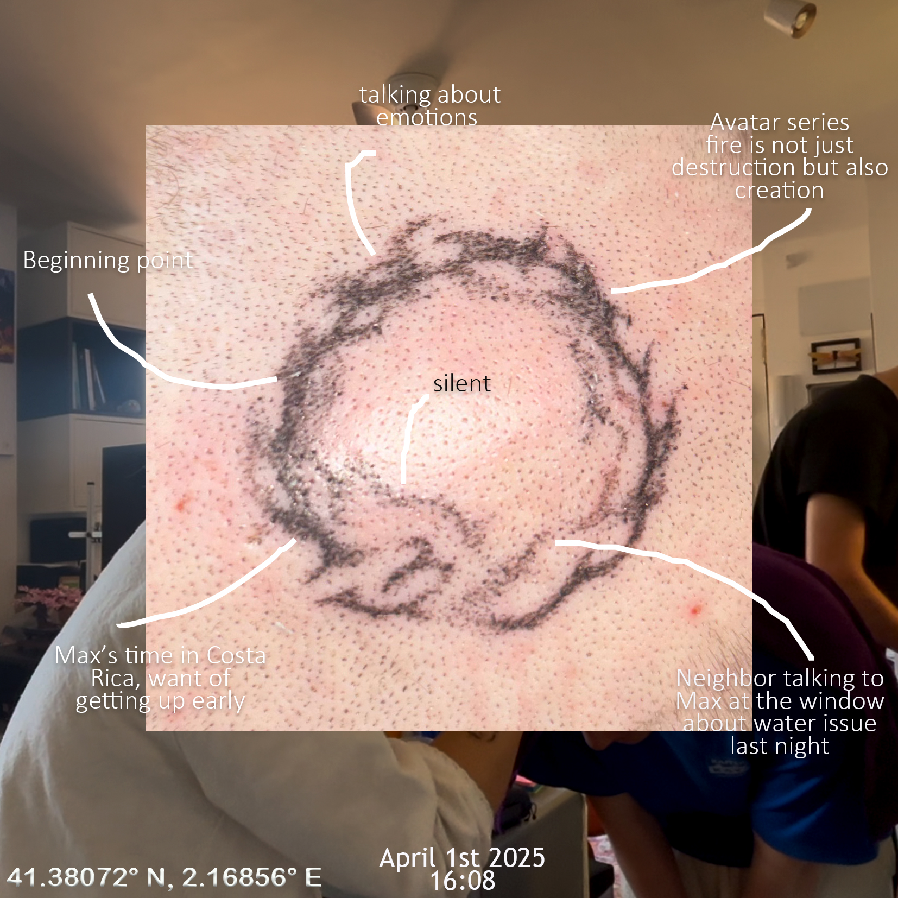
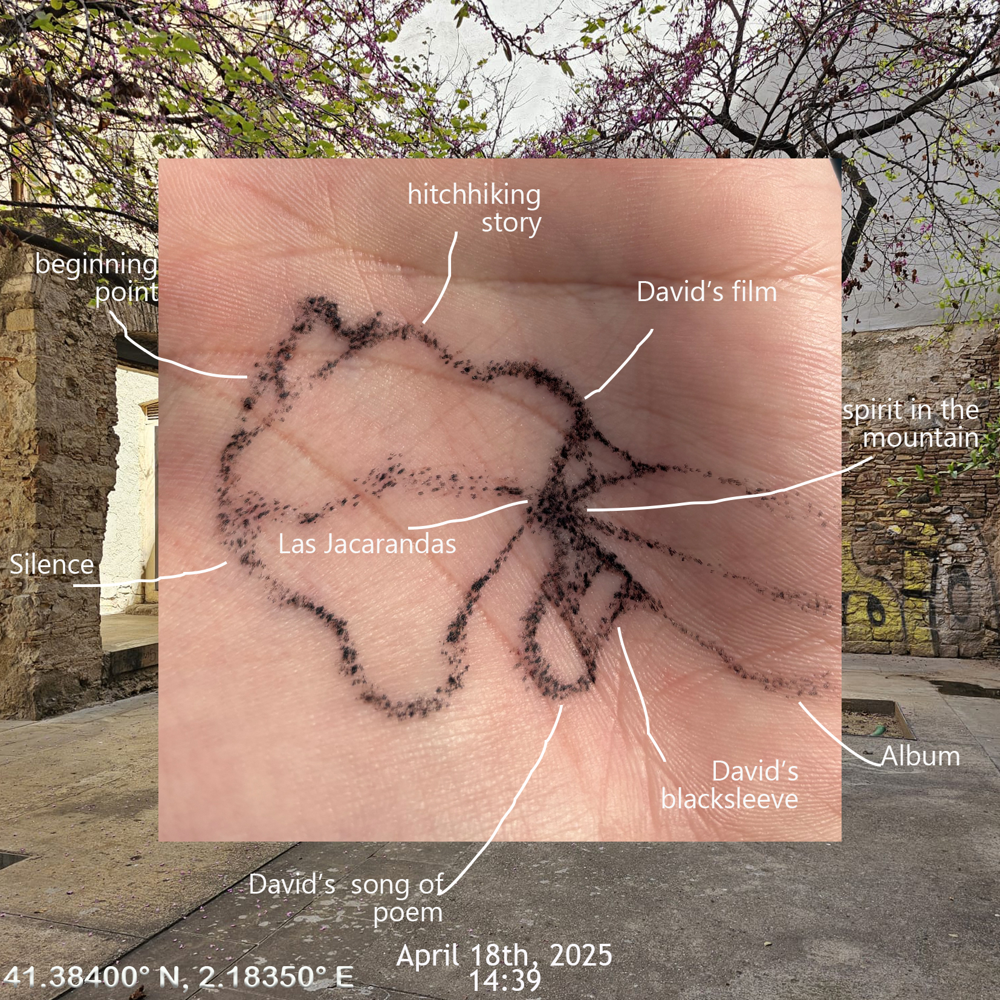
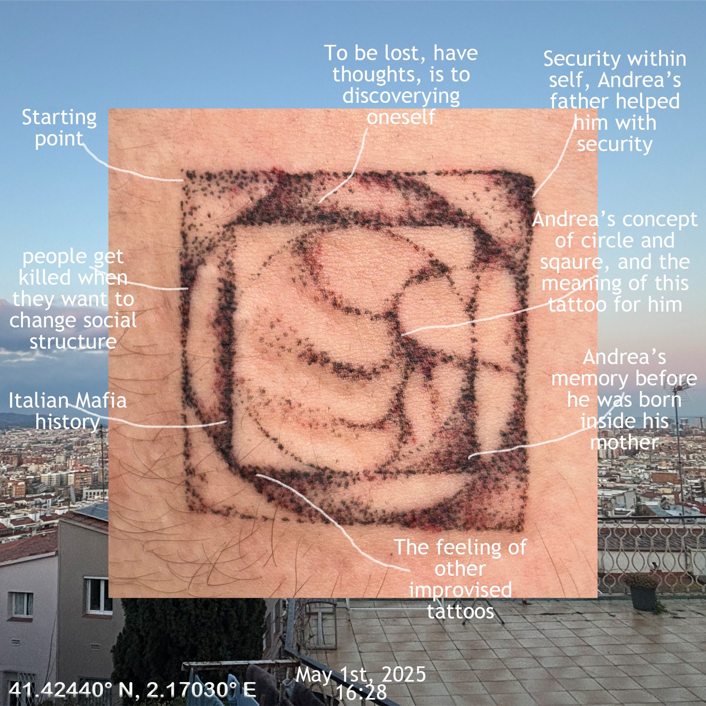
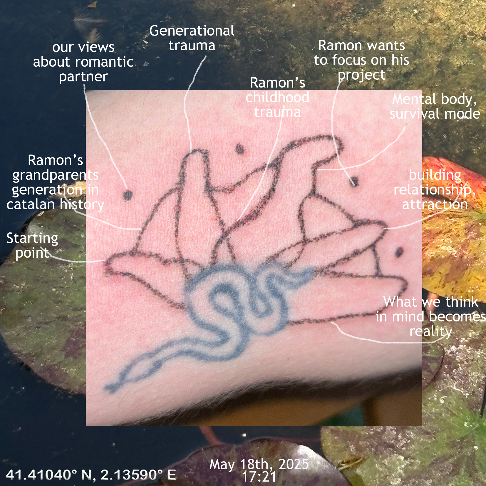

# 🎐 PUPA

A PUPA is a life stage when some insects undergoing a completion of metamorphosis.

For me, the pupa is going from an isolation of heart to openness, automized by subconsciousness, recording each moment by tattooing with another person.

This practice of roaming improvisation tattoo explores form of intuitive, collaborative expression rooted in verbal and non verbal communication. Operating at different locations in Barcelona, each tattoo emerges from a dialogue between me and the person who is getting the tattoo, which is shaped by the energy of the pure moment, the environment and the evolving connection between us. The tattoos are drawn spontaneously, guided by active listening and a sensitivity to the presence with the other person. By practicing shifting attention to our presence, we readjust our awareness towards nature, the body itself is an important aspect, to balance out the hyper focusing on intellectual.



The last stage of this project will happen during MDEFest at Les Tres Xemeneies on 19th June, 2025.

No. 7  The end of the cycle

I will wear a LED dress reacting with Vitti (I'm going to tattoo her)'s heartbeat with the sound of my heartbeat from the digital stethoscope.&#x20;

<figure><figcaption></figcaption></figure> <figure><figcaption></figcaption></figure> <figure><figcaption></figcaption></figure>

<figure><figcaption></figcaption></figure> <figure><figcaption></figcaption></figure> <figure><figcaption></figcaption></figure>

No.7 Les Tres Xemenies

<figure><figcaption></figcaption></figure>
