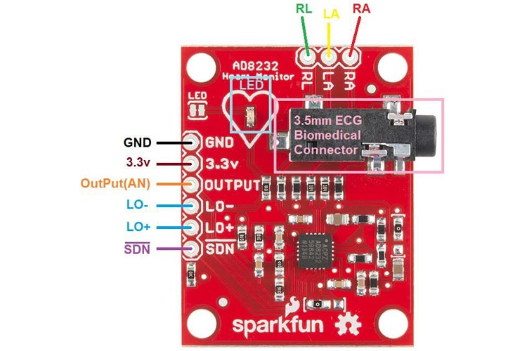
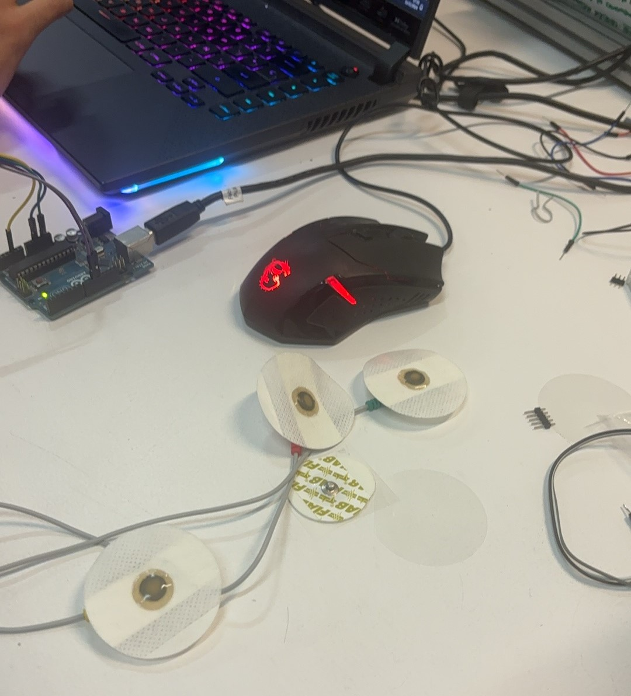

# Intervention II. Heartbeat Visualization

Group member: [Javier Serra Alonso](https://javierserraa.gitbook.io/home), Anya Hanna Biarozka, [Ziming Shang](https://smuzs-organization.gitbook.io/smuz-mdef)



## Beginning

At the beginning of the discussion, we desided the topic of our project is about the relationship between our mind and body. In order to learn how to use sensor and visualization software: touchdesigner, we eventually came up with the idea of using environment as the input, and signal visualization as the output. We wanted to start with the most aproachable sensor, then borrowed the heart sensor from the Fablab.

## AD8232

| Board Label | Pin Function         | Arduino Connection |
| ----------- | -------------------- | ------------------ |
| GND         | Ground               | GND                |
| 3.3 V       | 3.3 V power supply   | 3.3 V              |
| Output      | Output Signal        | A1                 |
| LO-         | Leads off - detect - | 11                 |
| LO+         | Leads off - detect + | 10                 |
| SDN         | Shutdown             | Not use            |

[The AD8232 from Analog Devices is a dedicated single lead heart rate monitor front end integrated circuit. The AD8232 is an integrated signal conditioning block for ECG and other biopotential measurement applications. It is designed to extract, amplify, and filter small biopotential signals in the presence of noisy conditions, such as those created by motion or remote electrode placement.](https://theorycircuit.com/arduino-projects/heart-rate-monitor-ad8232-interface-arduino/)

<figure><figcaption></figcaption></figure>

 

<figure><figcaption></figcaption></figure>

 

<figure><figcaption>
<a href="https://theorycircuit.com/arduino-projects/heart-rate-monitor-ad8232-interface-arduino/">https://theorycircuit.com/arduino-projects/heart-rate-monitor-ad8232-interface-arduino/</a>
</figcaption></figure>

## Arduino to Touchdesigner

We watched tutorial on Youtube.

Using the serial reading signal from Arduino read from AD8232, sending it through Math, connecting to a shape with adding noise to movement, and then send it to geometry, at last render.

<figure><figcaption></figcaption></figure>



## What do we want to learn from this experiement?

&#x20;At first, we thought to create a multi triggering senario which combines smell, sound and touch for the person who will wear the heart sensor, but then we thought it was too complicate for this project to start, and smell, sound, touch are too many variables to make an observation at last. So we minimize the input into only sound. We put our favorite songs into one track as the input.

“What was that like, watching your digital heart beat?”

**Personal feeling:**

As the drum started to drop in the track, my body tended to follow the drum beat. The mastering of the music affected my experience the most. The song which was with smaller volume and is less compressed brought less effect to my feeling. In the music with a strong drum beat and instruments I experienced chemical feelings (High) in my brain, now I understand more why people like to go to bars and music festivals. In songs with words, I experienced emotions through my heart.

**Based on the visual:**

The heart beat pattern expanded more based on the weight of the bass drum.

The connection of the green wire is not very accurate, I have to press it to make it read the signal. maybe because the pad is not sticky any more.

\
