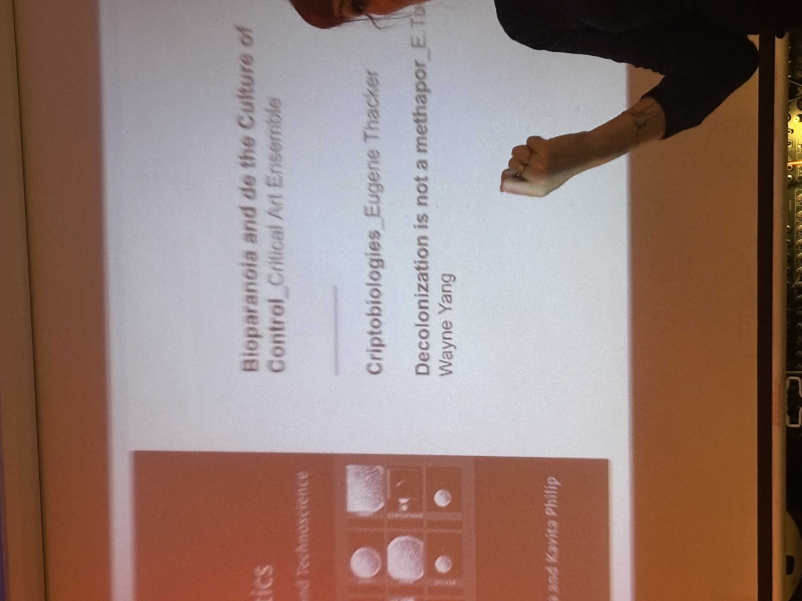

# Design with Others

## Dr. Marta Delatte


How to do things with design justice


In our group, we discussed the case of dating apps as in design juestice according to the four domains of the matrix domination.

***

## Espai Salamina

<figure><figcaption>
Slim mold
</figcaption></figure> <figure><figcaption></figcaption></figure> <figure><figcaption></figcaption></figure>

We listened to the talk of [Oscar](https://noconventions.mobi/noish/hotglue/) and[ Marzianx](https://marzianx.net/), and looked at their works in the studio.

<figure><figcaption>
Sound Installation detecting light by Oscar
</figcaption></figure>

***

## Mutan Monkey

<figure><figcaption></figcaption></figure>

<figure><figcaption></figcaption></figure> <figure><figcaption></figcaption></figure>



Synthesizers      Frequency detection sound      Faith            Passion        Compassion               Music

&#x20;        Collective        Active listening         Non-academic         No limitaion    Free                Jam     Theremin

***

## Arnau Sala



It was a pleasure to listen to Arnau's talk, because the ethics and values from Arnau's work is what I am looking for before coming to MDEF. I felt more encoraged and motivated to stand my ground, even though the main stream of society is still very different but shifting into a new eco dimension.

***

## Reflection

This week has been very interesting for me, becasue we can closely understand how these artists and professionals for their value, and being influenced by an ecosystem of design. The communication among all of us, including every instructors and classmates from MDEF is already forming an sustainable design environment and even an life environment for all of us. This is very important for a community to form a stable ongoing process of way of living during the fast pace change on Earth.

