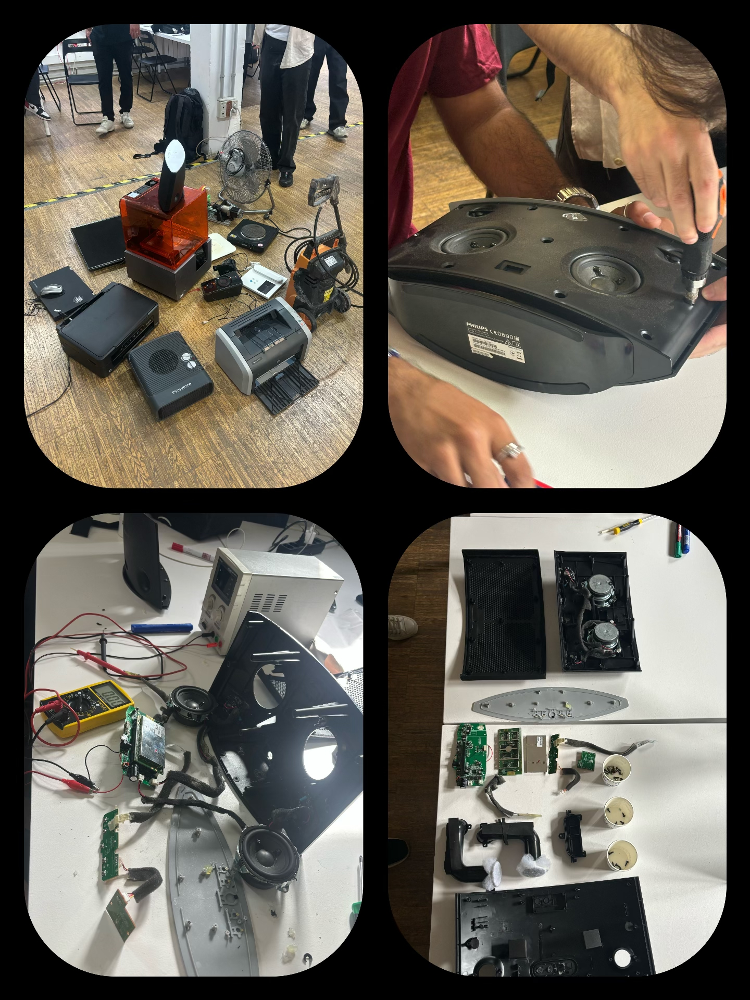
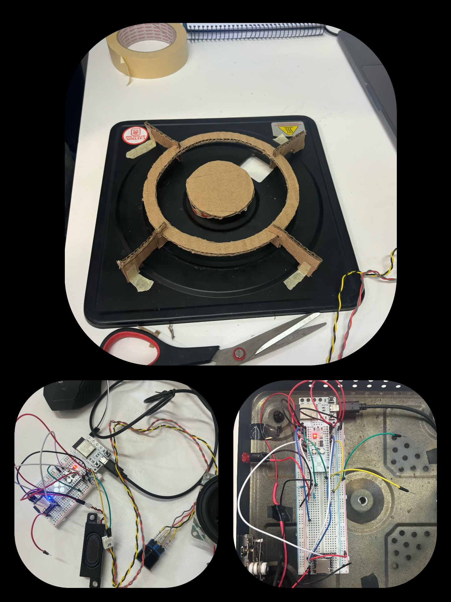
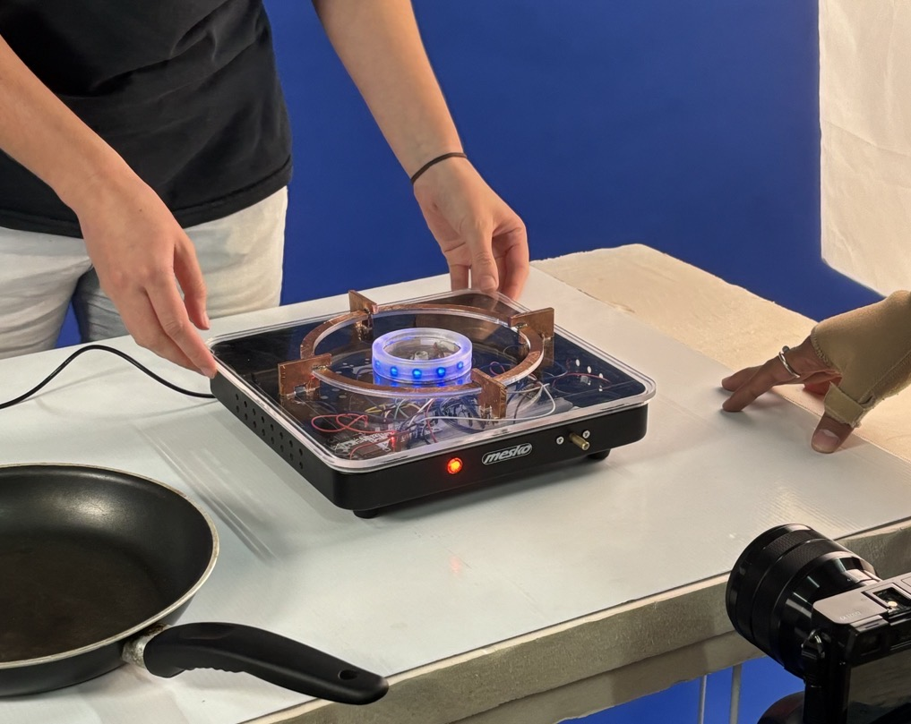

# The Machine Paradox

## Week I. Dissembling broken machine

We have dissembled two machines, the first one is a heat stove, and the other one is a Phillips Speaker.

<figure><figcaption></figcaption></figure>


Stove Forensic Report


<figure><figcaption></figcaption></figure>


Phillips Speaker Forensic Report


#### Reflection

This was a new experience for me that I had never dissembled any electronics before. At first I was a little lost with all the chips and the wires, but as more time was used to focus on the machines, the more understanding I learned about electronics. It was also interesting to learn from my teammates and to appreciate different people with different skills of knowledge.

***

## Week II. Re-create a machine

Through discussion, we decided to reverse engineer the stove into an audio reaction stove with human interaction. It consists three input: a knob, a button, and conductive sensor; two output: a speaker, LED lights; a controller (DFPlayer mini) and our Barduino.

<figure><figcaption>
First prototype and final electronic assembly
</figcaption></figure>

<figure><figcaption>
Final shoot~
</figcaption></figure>

#### Final presentation slides&#x20;



Final video



#### Refection

We came up with some other ideas of using the sound reactive motor and wifi signal detector, eventually we started with the stove idea because it is the most approachable plan, and the easiest to start. I explored a lot in the process of building arduino and coding with arduino IDE. At first I wanted to give up when we had some connection problem with DFPlayer mini, but eventually we got the chip to function. During the whole process, I appreciated all the help we can get from the instructors and classmates, the most precious thing is that how we learned new ways to think, create and work with each other.
