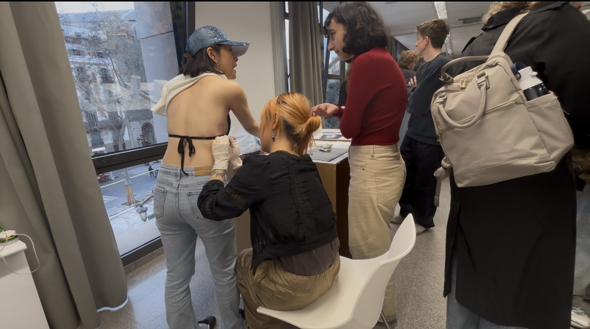
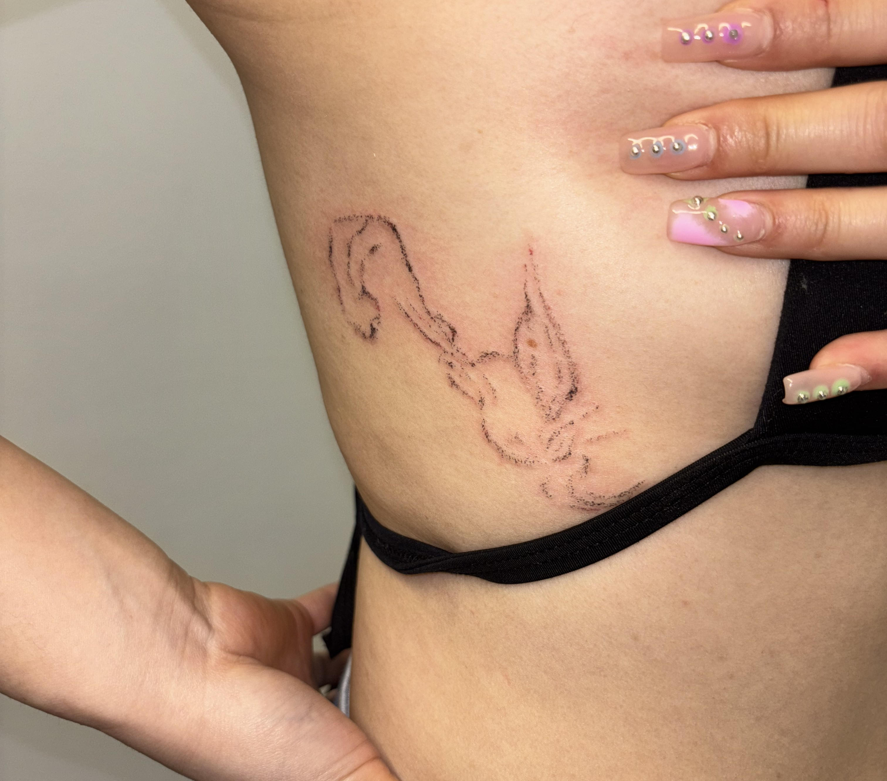

# Intervention: Improvisation Tattoo with Chi

<figure><figcaption></figcaption></figure>

This time at Elisava WIP exhibition, I tried to make another improvisation tattoo with Chi.

The line density represents the density between me and Chi.

We wore earpods to share music so that we can create a common space time just between us in the crowd.

It was very noisy in the room, I was a little overwhelmed at the beginning.&#x20;

If any other people come and talk to us, the line will stop and restart.

<figure><figcaption></figcaption></figure>



