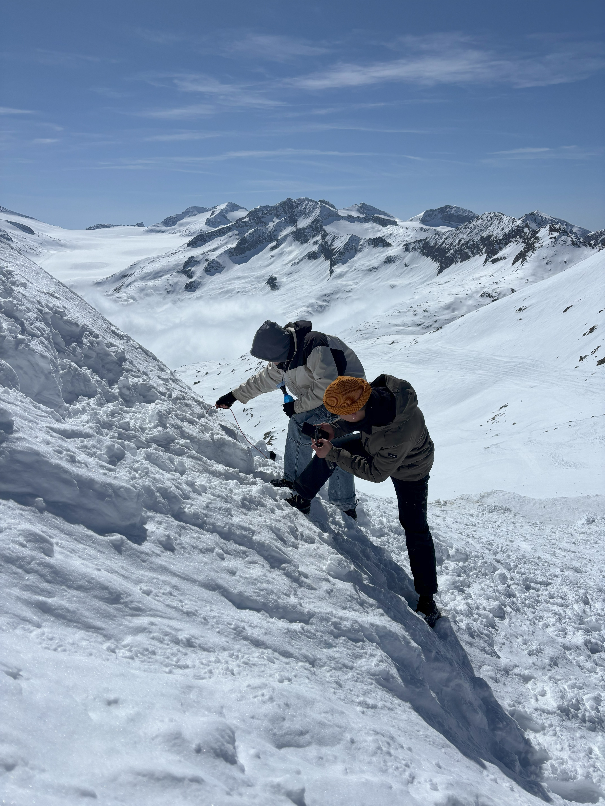
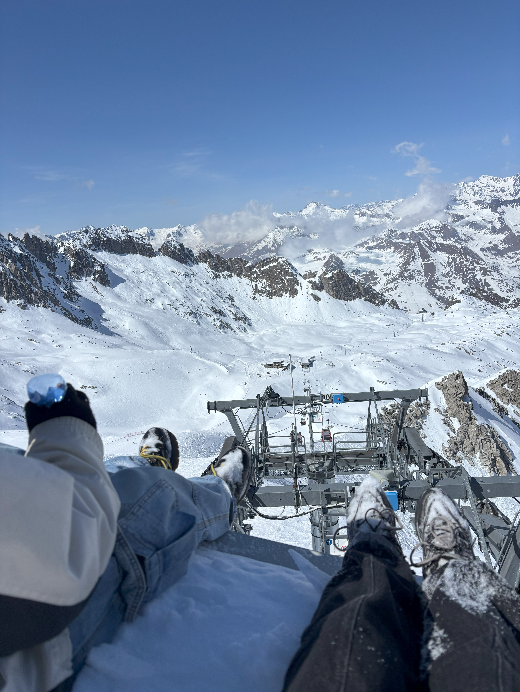
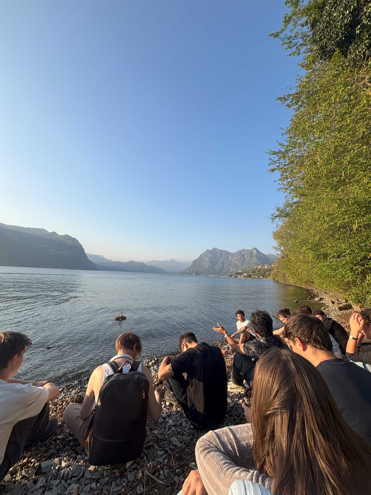

# Research Trip

<figure><figcaption></figcaption></figure>

This research explores the emotional and symbolic qualities of water through a sound-based field study. During a nature trip, I recorded various environmental sounds to document moments that drew my attention and deepened my understanding of water’s character. To me, water represents fluidity, emotion, and transformation. By layering these sound samples with my vocal, I composed a series of soundtracks that reflect both personal and shared experiences from the journey. These compositions culminated in a live performance for fellow students in my master’s program, celebrating our collective memories. I was particularly moved by a deep sense of sorrow in the valley of Cedegolo, from ancient spirits. This emotional intensity became an inspiration for me to transform it into music as a way to release and heal. Through this process, I recognized the power of sound to express, process, and share emotions. Just like water, feelings move, shift, and connect us. We cannot control water, but by listening and being present with it, we can learn from its wisdom. This project is both a reflection and a tribute to that ongoing flow between nature, emotion, and sound.

<figure><figcaption></figcaption></figure> <figure><figcaption></figcaption></figure> <figure><figcaption></figcaption></figure>

<figure><figcaption></figcaption></figure> <figure><figcaption></figcaption></figure> <figure><figcaption></figcaption></figure>

### My final presentation



### The music produced during the trip

The sound were recorded during the trip: water, leaves, steps, people talking, guitar, my vocal


