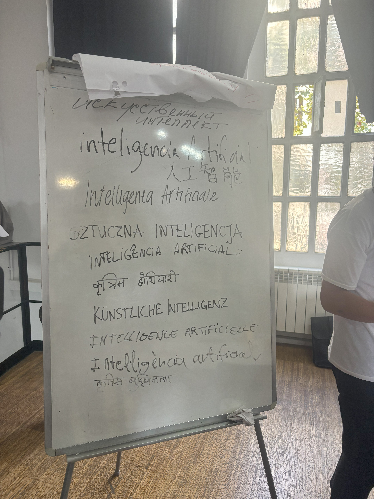

# Extended Intelligences

<figure><figcaption></figcaption></figure>


Syn-Garden Group Project


## Reflection

This course helped me to grow a new perspective about Artificial Intelligence. First, in the aspect of energy consuming, I understood how much water and electricity of our artificial intelligence is using. Secondly, the system and construction of how Artificial Intelligence is formed is clearer.&#x20;

Personally, I don't like to use AI. Instead I like real texture and my original thought process. However, I had to admit that the creation of AI is very efficient in the aspect of work production, and it make very practical solution when we need a clear proposal or organization of an idea. By enjoying our group projects in our class, I agreed with that if human use AI in a proper way, it will bring so much benefits to humanity. But, humanity is complex, we can never ensure we only use it for good.

In my recent conclusion, AI will develop in a way that humanity want it to be (subconsciously), it includes the emotion of fear but also love. We are all in this together and will witness AI's evolution.

