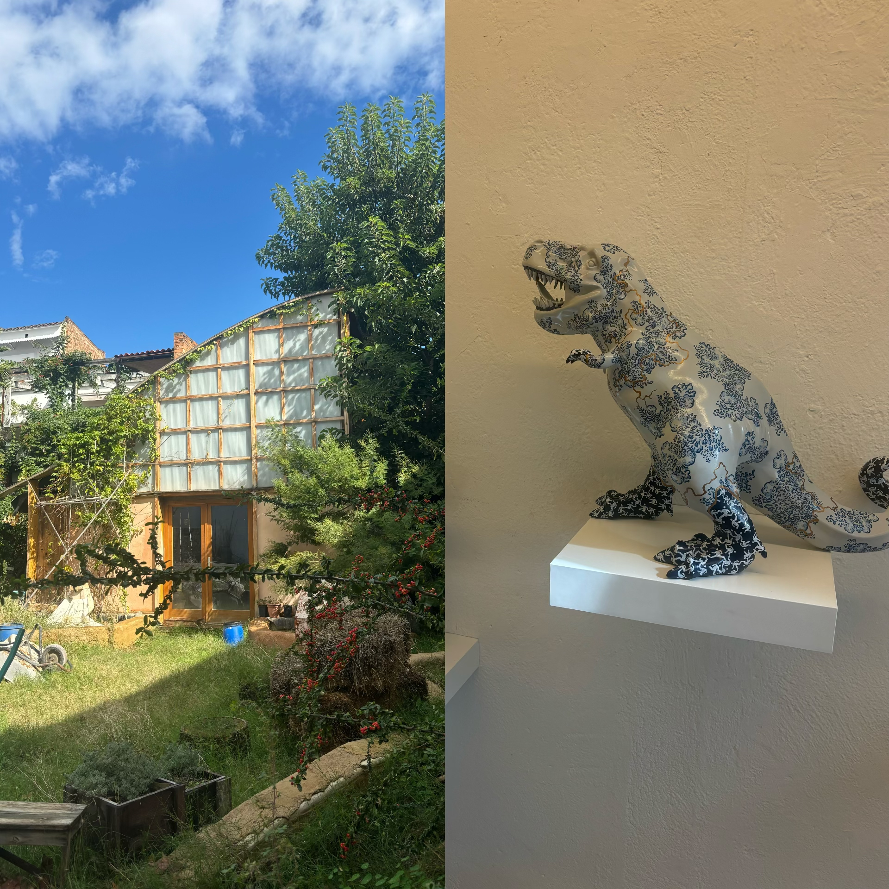

# Landing

<figure><figcaption></figcaption></figure>

Reflection&#x20;

During this week, I am still getting used to talk with many people. Since I had been working by myself or with smaller group of friends in the past five years, becoming more socialized is consuming more energy for me. I feel a huge shift in not only the environment and culture, but also in my structure of mind and my living habits.&#x20;

In the first class, we had introduction of ourselves which contains the objects that can represent ourselves, the closest community, heritage and the non-human influence around us. My objects are skateboard, keyboard, microphone and painting materials. The closest community around me is the underground art scence with music, handcrafts and art space. My heritage is the chill vibe from Chengdu, China where many find relaxtion in life and a city where is open to different opinions of ways of living. The non-human influence for me is nature, where I am able to reconnect with my heart and connect to earth.&#x20;

Visit of Poblenou district

<figure><figcaption></figcaption></figure>

