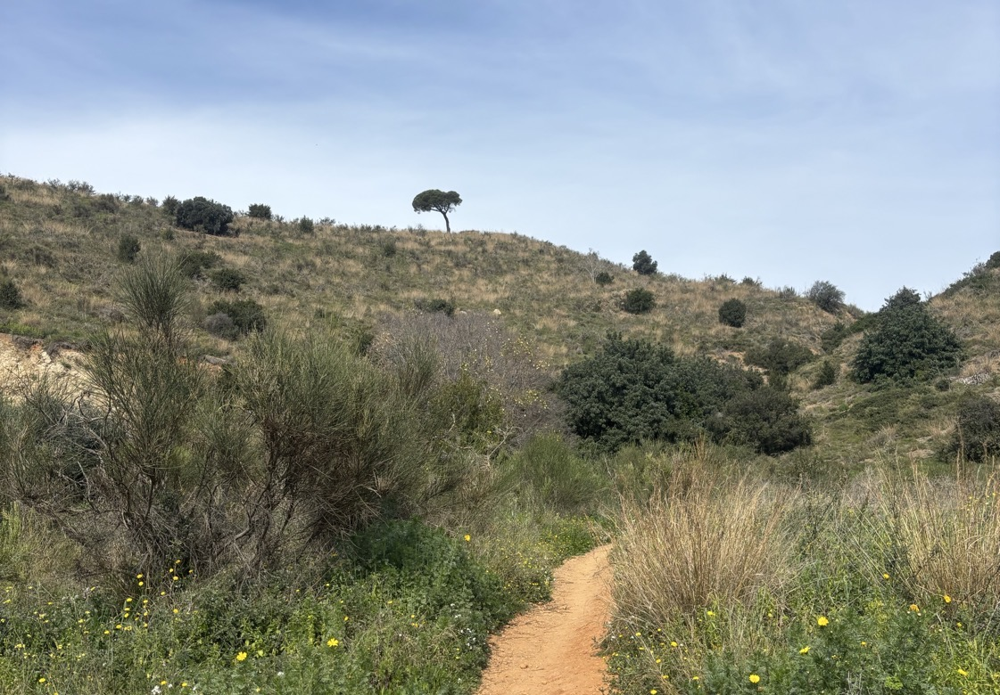

# Intervention: Improvisation Tattoo

This intervention is a imrpovised tattoo session with David at the foot of the mountain.

Handpoke

with the environment of nature, mountain view

With David's help, I tried with fabrication (drill) for the first time, I used to be so scared of these machine. We made a ink holder, to prevent the ink be blown away by wind in the nature.

<figure><figcaption></figcaption></figure> <figure><figcaption></figcaption></figure>

<figure><figcaption></figcaption></figure> <figure><figcaption></figcaption></figure> <figure><figcaption></figcaption></figure>

### About the pattern

I had no prior preparation of thought

my hand going with the flow of the conversation

conversation on: solid line

conversation off: dotted line

<figure><figcaption></figcaption></figure>

<figure><figcaption></figcaption></figure> <figure><figcaption>
The graph to reflect our conversation and the fluidity
</figcaption></figure>

I feel very fulfilled and happy after this tattoo session. I have been always thinking about non-conventional ways to make tattoo, and freehand is my favorite way. By using conversation as a input element to trigger the pattern so that both me and David could contribute to the pattern is what I am looking for in this mutual communication of tattoo session.

And also this is a performance to express of the present moment, we both focus and enjoy the present moment of the communication in seen and unseen way.&#x20;

