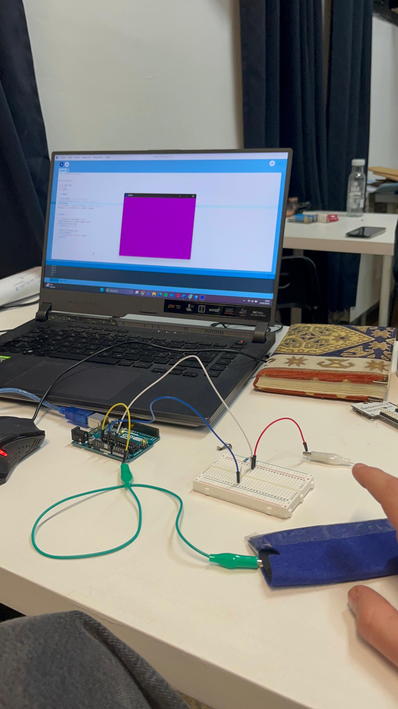

# H(n)MI

## Day 01

The first day Citlali introduced us how to make a pressure sensor, and connect it with Processing

<div><figure><figcaption></figcaption></figure> <figure><figcaption></figcaption></figure></div>

```javascript

import processing.serial.*;


Serial mySerial;

String myString;
int nl=10;
float myVal;

void setup()
{
  size(800,600); //size of the canvas
  printArray(Serial.list()); //name of the ports
  delay(1000);
  String myPort = Serial.list()[0]; //select that port
  mySerial = new Serial(this, myPort, 9600);
}

void draw() {
  
  while (mySerial.available() > 0) {
    myString=mySerial.readStringUntil(nl);
    background(125,0,125);
    if (myString !=null) {
      
      myVal=float(myString);
      println(myVal);
      circle(width/2, height/2, myVal);
      smooth();
    }
  }
}

```


## Day 02

We learned to use p5 with mouse interaction

<figure><figcaption></figcaption></figure>

## Day 03

We learned to use p5 in time-based interaction

<figure><figcaption></figcaption></figure>

## Day 04

We are the conductive nose team and we decided to explore music interaction using **P5.js**. We started with a simple theremin-like digital instrumen**t**, where moving the mouse controlled the frequency and volume of an oscillator. Our first goal was to replace the mouse input with hand tracking, making the interaction more intuitive and performative.

<figure><figcaption></figcaption></figure>

The following is the part for the hand gesture detected theremin



```javascript
let handPose; // Variable para el modelo de detección de manos
let video; // Variable para el video de la cámara
let indexFinger1 = null; // Posición del dedo índice de la primera mano
let indexFinger2 = null; // Posición del dedo índice de la segunda mano
let oscs = []; // Array para almacenar los osciladores del acorde
let playing = false; // Estado del sonido
let reverb;
let fingerTraces = []; // Array para almacenar las trazas de los dedos

function preload() {
  // Cargamos el modelo de ml5 para detección de manos
  handPose = ml5.handPose();
}

function setup() {
  createCanvas(windowWidth, windowHeight); // Crear el lienzo de 800x600
  // Configurar la cámara y ocultar el elemento de video
  video = createCapture(VIDEO);
  video.size(800, 800);
  video.hide();

  // Iniciar el modelo de detección de manos con la función de callback gotHands
  handPose.detectStart(video, gotHands);

  // Crear los osciladores para el acorde (root, major third, perfect fifth)
  let baseFreq = 542; // Frecuencia base (A3)
  oscs.push(new p5.Oscillator('sine')); // Oscilador para la nota raíz
  oscs.push(new p5.Oscillator('sine')); // Oscilador para la tercera mayor
  oscs.push(new p5.Oscillator('sine')); // Oscilador para la quinta justa
  oscs.push(new p5.Oscillator('sine'));

  // Configurar los osciladores
  for (let osc of oscs) {
    osc.start();
    osc.amp(0); // Empezar con volumen en 0
  }

  // Configurar el reverb
  reverb = new p5.Reverb();
  for (let osc of oscs) {
    reverb.process(osc, 4, 2); // Aplicar reverb a cada oscilador
  }
}

function draw() {
  background(0); // Fondo negro
  //image(video, 0, 0, width, height); // Mostrar el video en el lienzo

  // Dibujar las trazas de los dedos con efecto de desvanecimiento
  drawFingerTraces();

  if (indexFinger1 || indexFinger2) {
    // Si se detecta al menos un dedo, reproducir el sonido
    if (indexFinger1) {
      // Mapear la posición del dedo índice de la primera mano a la frecuencia base del acorde
      let baseFreq = map(indexFinger1.x, 0, width, 110, 880); // Mapear X a frecuencia base (A2 - A5)
      let amplitude = map(indexFinger1.y, 0, height, 1, 0); // Mapear Y a volumen (de 1 a 0, invertido)
      let indexfinger1y = map(indexFinger1.y, 0, height, height, 0);

      // Calcular las frecuencias del acorde (root, major third, perfect fifth)
      let chordFrequencies = [
        baseFreq, // Root
        baseFreq * Math.pow(2, 3 / 12), // Major third (4 semitones above root)
        baseFreq * Math.pow(2, 7 / 12), // Perfect fifth (7 semitones above root)
        baseFreq * Math.pow(2, 12 / 12),
      ];

      // Aplicar las frecuencias y volumen a los osciladores
      for (let i = 0; i < oscs.length; i++) {
        oscs[i].freq(chordFrequencies[i]);
        oscs[i].amp(amplitude, 0.1);
      }

      // Dibujar el punto en la posición del dedo índice de la primera mano
      fill(120, 56, 90);
      noStroke();
      circle(indexFinger1.x, indexfinger1y, 20);

      // Mostrar valores en pantalla
      textSize(16);
      textAlign(CENTER, CENTER);
      text(`Frecuencia base: ${int(baseFreq)} Hz`, width / 2, 30);
      text(`Volumen: ${int(amplitude * 100)}%`, width / 2, 50);

      // Guardar la posición del dedo índice de la primera mano en la traza
      fingerTraces.push({ x: indexFinger1.x, y: indexfinger1y, time: millis(), color: [0, 60, 200] });
    }

    if (indexFinger2) {
      // Usar la posición del segundo dedo índice para controlar la modulación
      let modulation = map(indexFinger2.x, 0, width, 0, 1); // Mapear X de la segunda mano a modulación (0 a 1)
      let indexfinger2y = map(indexFinger2.y, 0, height, height, 0);

      // Modificar la modulación en los osciladores
      for (let osc of oscs) {
        osc.amp(modulation, 0.1);
      }

      // Dibujar el punto en la posición del dedo índice de la segunda mano
      fill(20, 100, 90); // Rojo para la segunda mano
      noStroke();
      circle(indexFinger2.x, indexfinger2y, 20);

      // Mostrar valores en pantalla
      textSize(16);
      textAlign(CENTER, CENTER);
      text(`Modulación: ${int(modulation * 100)}%`, width / 2, 70);

      // Guardar la posición del dedo índice de la segunda mano en la traza
      fingerTraces.push({ x: indexFinger2.x, y: indexfinger2y, time: millis(), color: [20, 100, 20] });
    }
  } else {
    // Si no se detecta ningún dedo, detener el sonido
    for (let osc of oscs) {
      osc.amp(0, 0.1); // Desactivar el volumen
    }
  }

  // Eliminar trazas antiguas (más de 5 segundos)
  let currentTime = millis();
  fingerTraces = fingerTraces.filter(trace => currentTime - trace.time < 5000);
}

// Función para dibujar las trazas de los dedos
function drawFingerTraces() {
  let currentTime = millis();
  for (let trace of fingerTraces) {
    let age = currentTime - trace.time; // Edad de la traza en milisegundos
    let opacity = map(age, 0, 5000, 255, 0); // Mapear la edad a opacidad (255 a 0)
    fill(trace.color[0], trace.color[1], trace.color[2], opacity);
    noStroke();
    circle(trace.x, trace.y, 20);
  }
}

// Función que recibe los datos de la detección de manos
function gotHands(results) {
  // Reset fingers each frame
  indexFinger1 = null; // Left hand (green)
  indexFinger2 = null; // Right hand (red)

  if (results.length > 0) {
    // Loop through all detected hands
    for (let hand of results) {
      let keypoints = hand.keypoints;
      let indexFinger = keypoints.find(point => point.name === 'index_finger_tip');

      if (indexFinger) {
        // Adjust for 180° rotation
        let rotatedX = width - map(indexFinger.x, 0, video.width, 0, width);
        let rotatedY = height - map(indexFinger.y, 0, video.height, 0, height);

        // Check handedness and assign accordingly
        if (hand.handedness === "Left") {
          indexFinger1 = { x: rotatedX, y: rotatedY };
        } else if (hand.handedness === "Right") {
          indexFinger2 = { x: rotatedX, y: rotatedY };
        }
      }
    }
  }
}
```



Hand-Controlled Oscillator

```
<!-- Librerías de p5.js y p5.sound -->
<script src="https://cdnjs.cloudflare.com/ajax/libs/p5.js/1.11.1/p5.js"></script>
<script src="https://cdnjs.cloudflare.com/ajax/libs/p5.js/1.11.1/addons/p5.sound.min.js"></script>

<!-- Librería de ml5.js para detección de manos -->
<script src="https://unpkg.com/ml5@1/dist/ml5.min.js"></script>
```

&#x20;



As we progressed, we realized the potential of modifying both the **interaction method and the sound output.** To deepen our exploration, each team member developed their own unique hand/(non)hand-controlled instrument, leading to a final collaborative orchestra performance, which we named **"Conductive Noise Orchestra"**

* **Andrea** focused on percussive sounds and effects, using **mouth opening and closing** to trigger drum beats.
* I designed a system where finger movements controlled multiple sounds, creating complex textures.
* **Javi** developed a mixing table where two index fingers controlled track transitions, adjusting volume (Y-axis) and playback speed (X-axis).

**Final performance: visual & sound integration**

To enhance the live experience, we implemented real-time reactive visuals synchronized with the sounds. This turned our performance into a fully immersive audio-visual piece, blending generative art with interactive music.

Our Conductive Noise Orchestra demonstrated how hand gestures could transform digital instruments into expressive tools, blurring the lines between body movement, technology, and sound composition.

<figure><figcaption></figcaption></figure>


