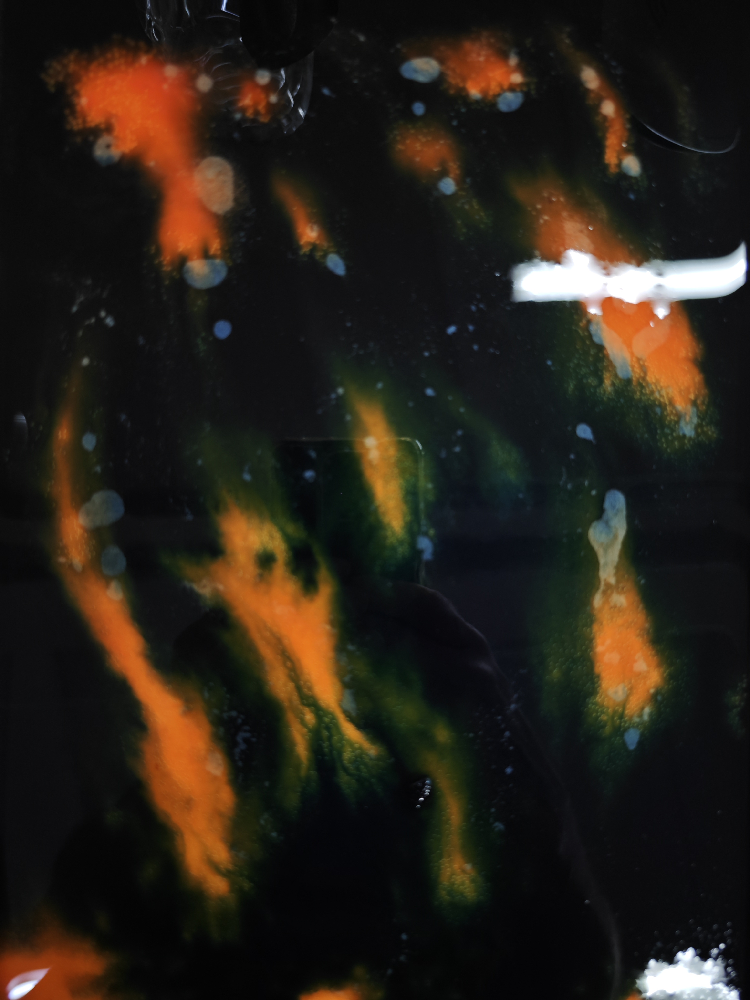
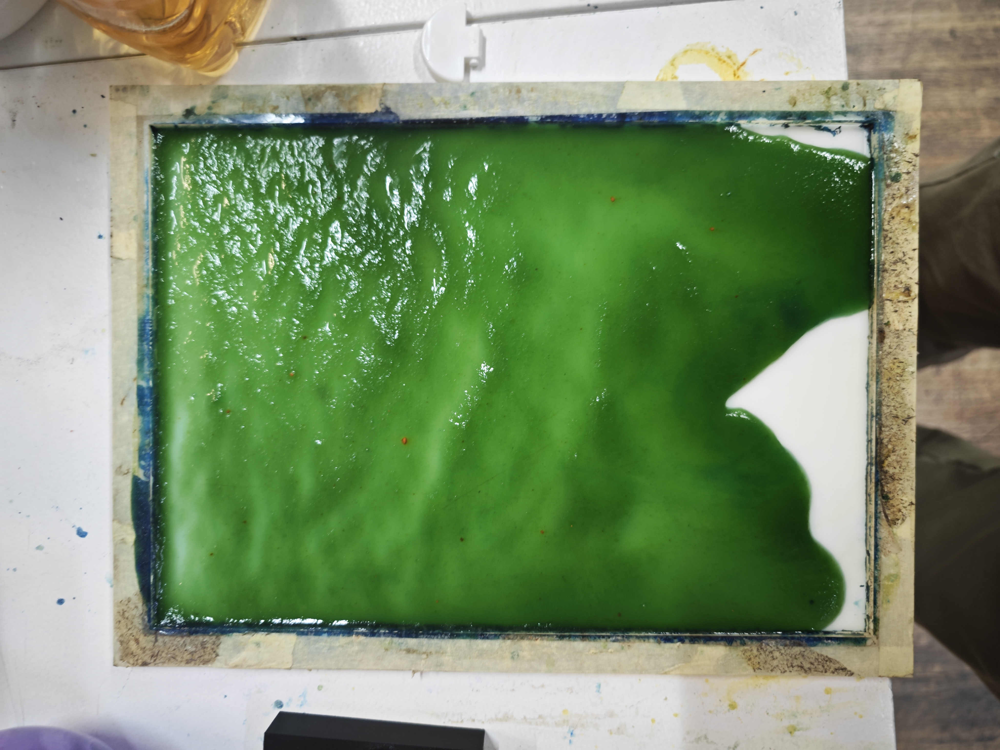

# Bio-electronic interface for body response

<figure><figcaption></figcaption></figure>




[Javier Serra](https://javierserraa.gitbook.io/term-2/undefined/microchallenges)&#x20;

[Carlos Silveira](https://carlossilveiradesign.gitbook.io/mdef-diary)

[Ziming Shang](https://smuzs-organization.gitbook.io/smuz-mdef)



Carlos brought a strong focus on **healthcare applications**, exploring how technology could enhance well-being and monitor physiological signals. Javi and I are interested more towards **artistic expression** and **body sensing**, aiming to capture and communicate **emotional responses** through wearable technology. This fusion of perspectives inspired the concept of a device that not only monitors the body but also serves as a form of **self-expression**.

<figure><figcaption></figcaption></figure>



The initial idea began as a **bio-reactive tattoo** designed to reflect bodily changes through color and movement. However, as our exploration deepened, the concept evolved into a more complex **wearable interface** that could integrate both biological sensing and dynamic visual feedback. This shift allowed us to experiment with multiple materials, sensors, and design approaches, leading to a versatile prototype.

<div><figure><figcaption></figcaption></figure> <figure><figcaption></figcaption></figure></div>



The device features two key layers: a **pH-reactive hydrogel** with **Bromothymol Blue** that changes color based on sweat acidity, visualizing the body's pH in real time, and a **ferrofluid microfluidic circuit** that moves in response to **electromagnetic fields** controlled by a **GSR sensor**, reflecting stress and emotional fluctuations.



## Progress divided:

1. **Hydrogel Development:** We experimented with BTB as a pH indicator, testing both **agar-agar** and **sodium alginate** to create a reactive hydrogel. While agar-agar showed good reactivity, it was unstable over time, prone to fracturing, and retained moisture. Sodium alginate, though slower to dry, proved more **stable and transparent**, making it a better option for future iterations.

<div><figure><figcaption></figcaption></figure> <figure><figcaption></figcaption></figure> <figure><figcaption></figcaption></figure></div>

<div><figure><figcaption></figcaption></figure> <figure><figcaption></figcaption></figure> <figure><figcaption></figcaption></figure></div>



2. **Ferrofluid Creation:** Producing stable ferrofluid was challenging. We initially used iron oxide but later switched to **metal shavings**, which were more magnetic. The best suspension medium was **hypersaturated saltwater**, which stabilized the ferrofluid and prevented separation. We learned that the ferrofluid must be fully submerged to maintain its integrity.

<div><figure><figcaption></figcaption></figure> <figure><figcaption></figcaption></figure> <figure><figcaption></figcaption></figure></div>



3. **Circuit and GSR Integration:** We built a circuit using a GSR sensor to detect skin conductivity changes, intending to control electromagnets for ferrofluid movement. However, the GSR sensor provided **overly stable signals**, insufficient to drive the electromagnets effectively. We adapted by creating a **variable intensity circuit** suitable for different sensors or considering a simpler **on/off control** mechanism.

<figure><figcaption></figcaption></figure>



4. **Wearable Design and Molding:** The device was designed to be worn on the neck, with **3D-printed molds** used for silicone casting. Some materials were too fragile, and we found that **thinner silicone walls** improve the electromagnetic response. Adjustments are needed to optimize the mold design, possibly replacing the hydrogel with **liquid-filled capsules** for clearer sweat visualization.


````cpp

#define BTN_PIN 7
#define BTN_PINUP 6
#define EM_PIN  8
int GSR = A5;
//int POTPIN = A0;
int sensorValue=0;
int gsr_average=0;
// Adjust the value using the clamp function
  int minValue = 380;
  int maxValue = 379;


 
unsigned long T1 = 0, T2 = 0;
uint8_t TimeInterval = 1; // 5ms
 
void setup() {
  Serial.begin(9600);
  pinMode(BTN_PIN, INPUT);
  pinMode(EM_PIN, OUTPUT);
  DDRB |= (1 << DDB1) | (1 << DDB2);                     // Set ports
  TCCR1A = (1 << COM1A1) | (1 << COM1B1) | (1 << WGM11); // Fast PWM mode    
  TCCR1B = (1 << WGM12) | (1 << WGM13) | (1 << CS10);    // Fast PWM mode, no clock prescaling possible
  OCR1A = 3240;                                          // Start PWM just below MOSFET turn on
  ICR1 = 8191;   
}
 
void loop() {
  
  
  long sum=0;
  for(int i=0;i<10;i++)           //Average the 10 measurements to remove the glitch
      {
      sensorValue=analogRead(GSR);
      sum += sensorValue;
      delay(1);
      }
   gsr_average = sum/10;
   Serial.print("GSR Average:");
   Serial.println(gsr_average);//*
   int human_resistance = ((1024+2*gsr_average)*10000000)/(516-gsr_average);
   Serial.print("human_resistance=");
   Serial.println(human_resistance);
   delay(1);
  
  

  // Use the function to clamp the value within the given range
  //int adjustedValue = clampValueToRange(gsr_average, minValue, maxValue);
  //clampValueToRange(gsr_average, minValue, maxValue);
  if (gsr_average < minValue) {
    minValue = gsr_average;  // Set to the minimum if the value is below minValue
  } else if (gsr_average > maxValue) {
    maxValue = gsr_average;  // Set to the maximum if the value is above maxValue
  } else{}
  // Print the original and adjusted values
  Serial.print("Original Value: ");
  Serial.print(gsr_average);
  Serial.print("  Adjusted Value: ");
  //Serial.println(adjustedValue);

  Serial.print("MinValue: ");
  Serial.println(minValue);
  Serial.print("MaxValue: ");
  Serial.println(maxValue);
  delay(600);  // Wait a bit before reading again

  T2 = millis();
  
  if( (T2-T1) >= TimeInterval) // Every 5ms
  {
    int mappedvalue = map(gsr_average,minValue,maxValue,3242,8191);
    Serial.print("Mappedvalue:");
    Serial.println(mappedvalue);//*
    // Read The Electromagnet Enable Button State
    //int test = 8100;
    //analogWrite(A1,test); // This writes the power to the Mosfet from 0-1024.
    //3242-8191

    OCR1A = mappedvalue;
    T1 = millis(); 
  }
}
 


```
````



***

### Reflection

* In order to finish the prototye, we still need to fill the ferrofluid into the mold. The ferrofluid we found in fablab can be carried in saltwater.
* The data that GSR sensor collects is very steady, we tried to map the data range in coding to make a obvious change for electricity current that go through the electromagnet, but the change was still tiny to make the movement in ferrofluid.&#x20;
* It was a lot of tasks to complete for 4 days

