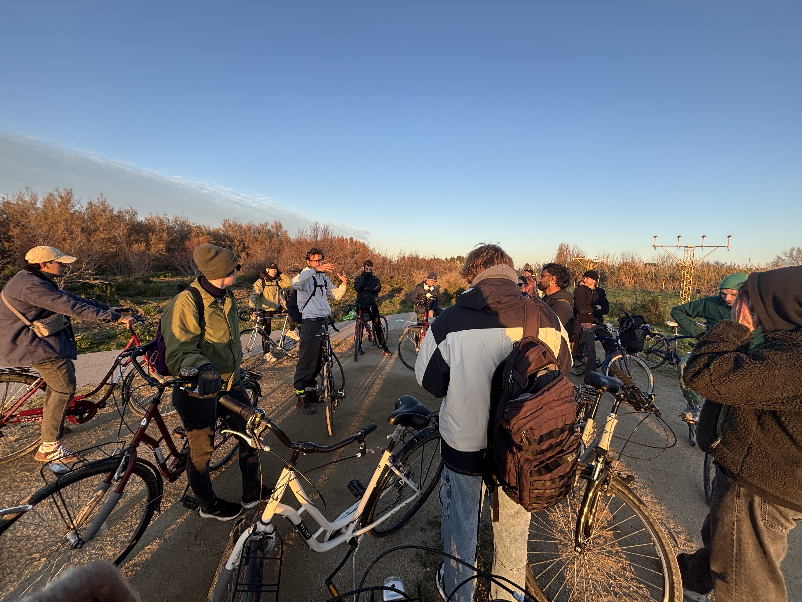

# Situacted Design Practices

## 01 Cal Negre

<figure><figcaption></figcaption></figure>

a bike tour in El Prat

Cal Negre, farm, Collaboration studios, workshops, lands,&#x20;

For lunch, we had paella with the vegetables which were harvested from the farm.

<figure><figcaption></figcaption></figure> <figure><figcaption></figcaption></figure>

***

## 02 Hibar  Arbide

Refugee life

rescue reconstruction

I admire the strong mentality to work for refugee community with such harsh social environment.

***

## 03 Jokkoo Collective

African artist collective&#x20;

community, space for artist to show and perform, parties

renovated factory, community radio, art space

<figure><figcaption></figcaption></figure> <figure><figcaption></figcaption></figure>

<figure><figcaption></figcaption></figure> <figure><figcaption></figcaption></figure> <figure><figcaption></figcaption></figure>

Jokkoo collective's intention is clear and straight forward, which in my understanding is to construct a community especially for artists who are foreign to Barcelona but now is based in Barcelona to have a space to perform and show the talents, and also is a platform for creators and people with similar interests to come together.

We collected sounds individually, and then we sampled all of our sounds and made a aollective jam!



***

## 04 Ben Ditto

Personally Ben's presentation is very helpful.

I was always curious about what is behind these cyber active people that are always posting (too) many information which made me feel so choatic.

Today, ben ditto solved my mystery. The most interesting fact about him is that he really enjoys shit posting and surfing on internet, he doesn't think it's a waste of time to be on social media.

Everybody is doing the same thing, scrolling on internet, but with different mindset and intention, the purpose and the outcome change.&#x20;

I used to be super careful about what i share online, that I didn't like to share "wrong" information to people, until today I heard Ben said he likes to "mess with people's mind" (if I remembered correctly). I felt relief. >3< Why so serious?

Then I tried applying Ben Ditto's mindset for my internet surfing time, it was fun and  I found more possibility on the internet to explore.

Object is just an object, tool is a tool, phenomenon is phenomenon. Human like to add all sort of explanation onto the natural state of being. We are the one who can decide what filter to add on Being in order to achieve what we want, consciously or uncousciously.

