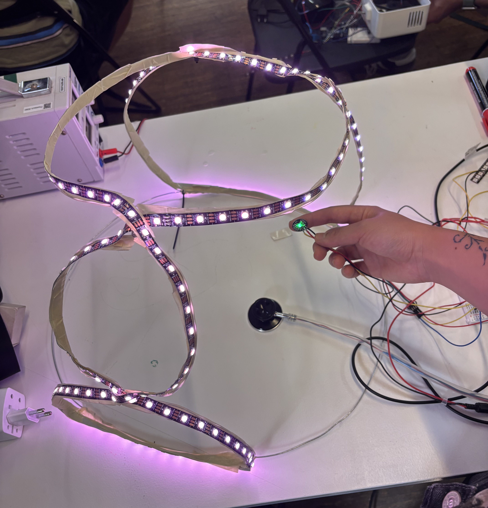
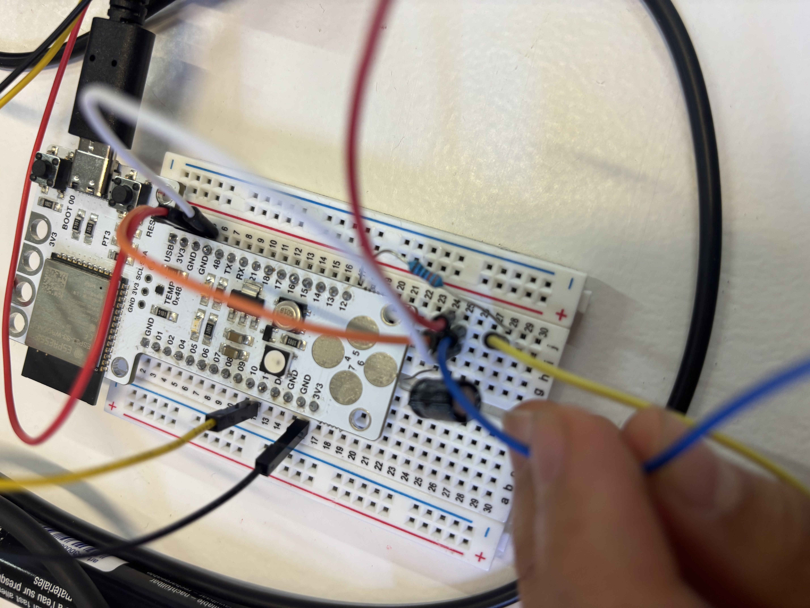
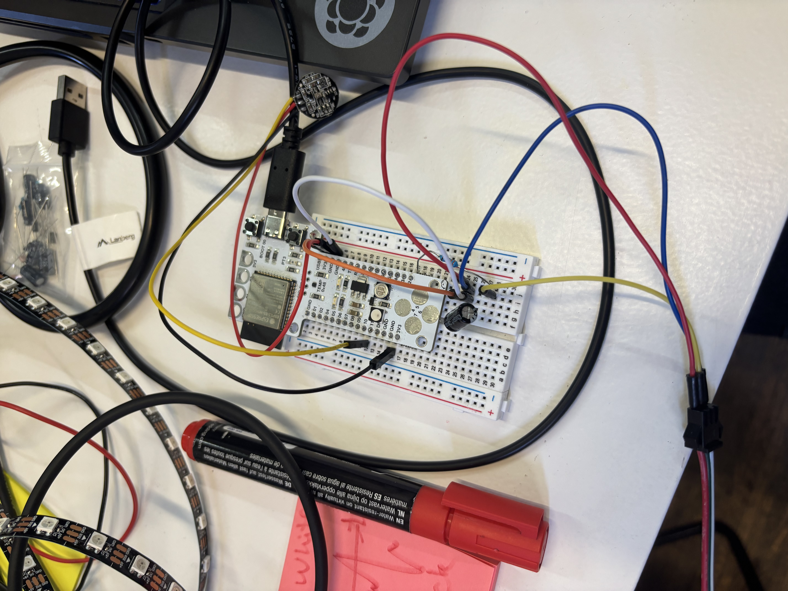
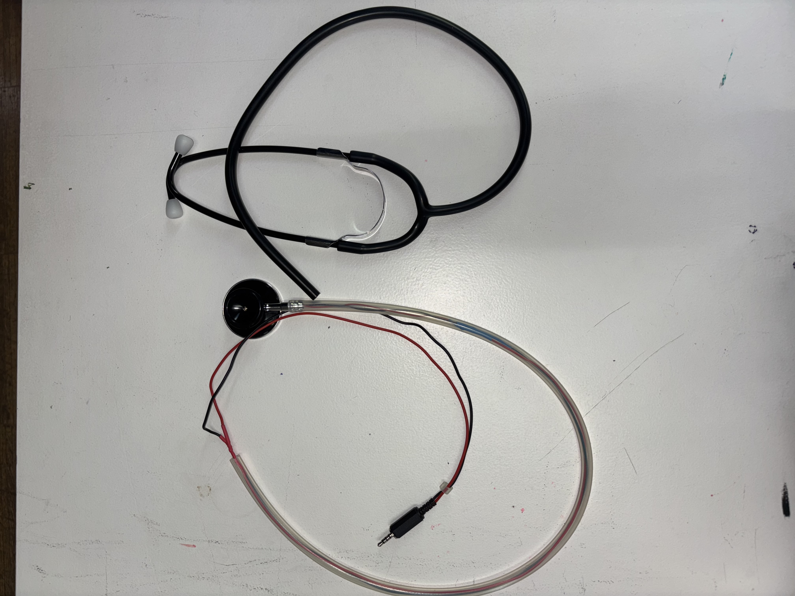
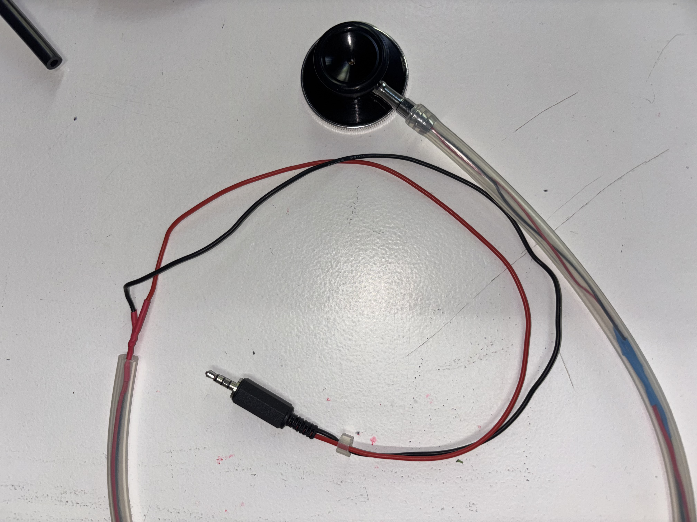
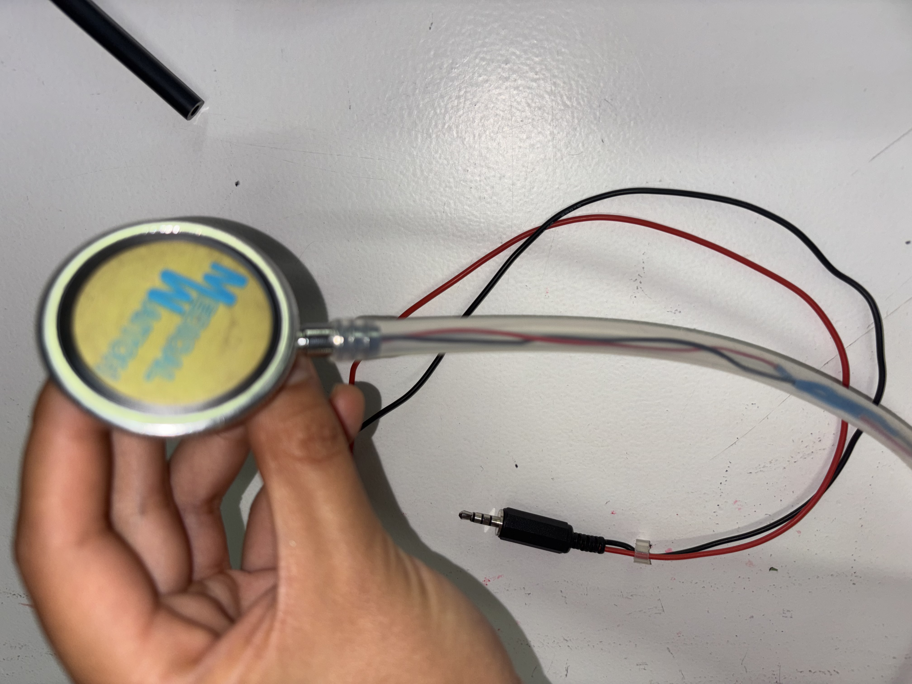
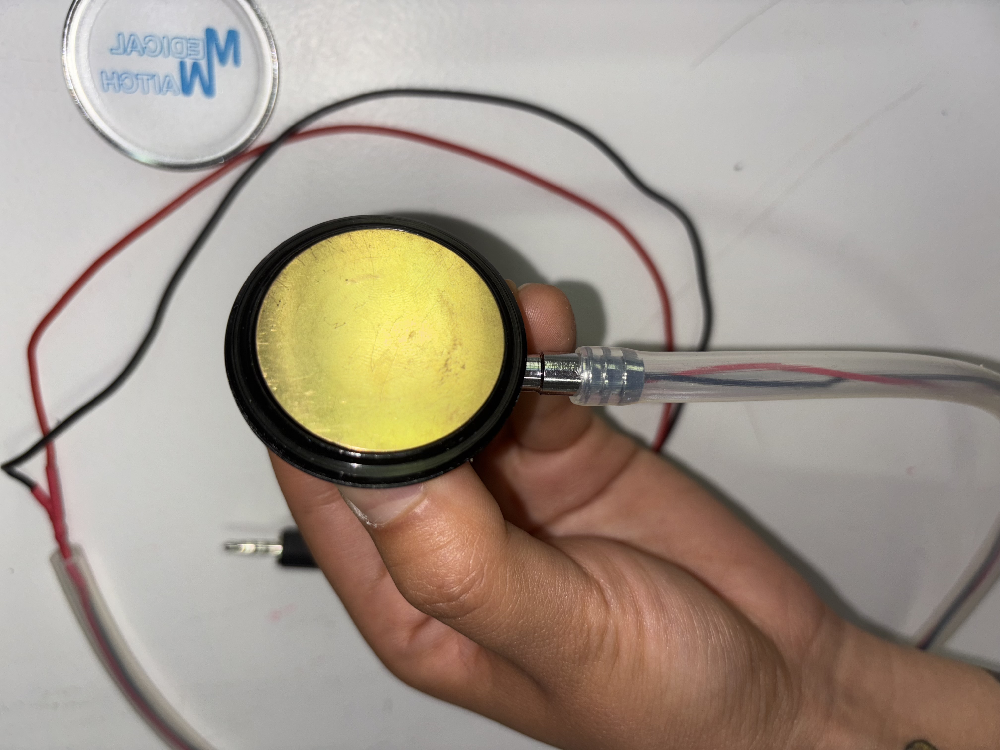

# MicroChallenge (MDEFest)

<figure><figcaption></figcaption></figure>

I am building a heartbeat LED Installation and a digital stethoscope to use in the MDEFest. My project is going to be a performance of live improvisation tattoo, the installation will help audience to understand the context of unconscious abstract communication between me and the tattoo receiver, and to watch the live process of recording every fragile imperfection moment during this tattoo creation.

<div><figure><figcaption><p>Connecting heartbeat sensor to LED strip</p></figcaption></figure> <figure><figcaption></figcaption></figure></div>

```cpp
#include <FastLED.h>

#define NUM_LEDS 171
#define LED_PIN 12
#define FADE_RATE 20    // How quickly the LEDs fade (higher = faster fade)
#define RISE_RATE 80    // How quickly the LEDs light up (higher = faster rise)
#define MAX_BRIGHTNESS 200  // Maximum brightness for LEDs

CRGB leds[NUM_LEDS];
int const PULSE_SENSOR_PIN = 10;   // 'S' Signal pin connected to A0
int Signal;                // Store incoming ADC data. Value can range from 0-1024
int Threshold = 1990;      // Determine which Signal to "count as a beat" and which to ignore.

// Variables for animation
bool beatDetected = false;
int animationBrightness = 0;

void setup() {
  FastLED.addLeds<WS2812B, LED_PIN, GRB>(leds, NUM_LEDS);
  FastLED.setBrightness(100);
  pinMode(LED_BUILTIN, OUTPUT);  // Built-in LED will blink to your heartbeat
  Serial.begin(9600);           // Set comm speed for serial plotter window
}

void loop() {
  Signal = analogRead(PULSE_SENSOR_PIN); // Read the sensor value
  Serial.println(Signal);                // Send the signal value to serial plotter
  
  // Beat detection
  if(Signal > Threshold) {
    if (!beatDetected) {
      // New beat detected - trigger animation
      beatDetected = true;
      digitalWrite(LED_BUILTIN, HIGH);
    }
  } else {
    beatDetected = false;
    digitalWrite(LED_BUILTIN, LOW);
  }
  
  // Animation handling
  updateAnimation();
  
  delay(10);
}

void updateAnimation() {
  if (beatDetected && animationBrightness < MAX_BRIGHTNESS) {
    // Gradual increase in brightness when beat is detected
    animationBrightness += RISE_RATE;
    if (animationBrightness > MAX_BRIGHTNESS) {
      animationBrightness = MAX_BRIGHTNESS;
    }
  }
  else if (!beatDetected && animationBrightness > 0) {
    // Gradual decrease in brightness when no beat is detected
    animationBrightness -= FADE_RATE;
    if (animationBrightness < 0) {
      animationBrightness = 0;
    }
  }
  
  // Apply the brightness to all LEDs
  if (animationBrightness > 0) {
    for (int i = 0; i < NUM_LEDS; i++) {
      // Using white light with calculated brightness
      leds[i] = CHSV(10, 100, animationBrightness);
    }
    
    // Add some blur for a smoother look
    blur1d(leds, NUM_LEDS, 64);
  } else {
    // Turn off all LEDs
    for (int i = 0; i < NUM_LEDS; i++) {
      leds[i] = CRGB::Black;
    }
  }
  
  FastLED.show();
}
```



I am building a digital stethoscope to digitally amplify the analog sound of the heartbeat, hopefully to play it live during the MDEFest performance. Now the sound is still very low, I have to check if I can compress the sound and play it on my amplifier at home.

<div><figure><figcaption></figcaption></figure> <figure><figcaption></figcaption></figure> <figure><figcaption></figcaption></figure> <figure><figcaption></figcaption></figure></div>

The process has been going smoothly during this microchallenge, I've been receiving a lot of help from fablab and am able to produce the products at the end. To be honest, I like the workflow of working alone, and I liked everyone's project. Since we are focusing on our own projects, it is better to concentrate on our own for this last microchallenge. I feel a bit emotional becasue I really enjoyed all the microchallenges even though it was exhausted, but the time shared together and the atmosphere of making things asking for help really nurtured me in some way.
