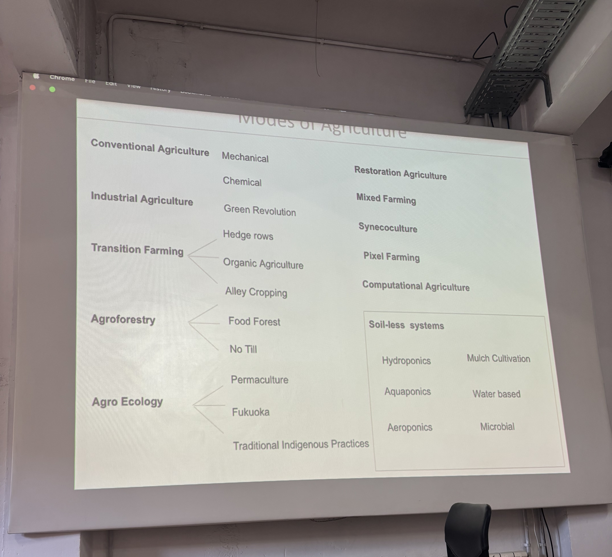
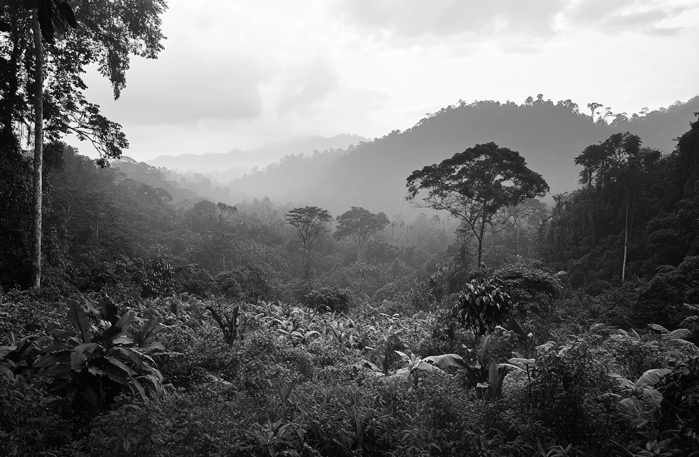

# Agriculture Zero

## Different types of agriculture

<figure><figcaption></figcaption></figure>

## Day to Vallduara Lab

&#x20;                                                           Plant recognition along the hiking way

I leaned to observe how the plantation change along the way.&#x20;

Some plants are the indication of sign of water.

<figure><figcaption>
Farm
</figcaption></figure> <figure><figcaption>
Vallduara Farm
</figcaption></figure> <figure><figcaption></figcaption></figure> <figure><figcaption></figcaption></figure> <figure><figcaption>
Fruit growing from the leaf
</figcaption></figure>

<figure><figcaption></figcaption></figure> <figure><figcaption></figcaption></figure> <figure><figcaption></figcaption></figure> <figure><figcaption></figcaption></figure> <figure><figcaption>
insect
</figcaption></figure>

&#x20;                                                                                    Greenhouse

<figure><figcaption></figcaption></figure> <figure><figcaption></figcaption></figure> <figure><figcaption></figcaption></figure> <figure><figcaption></figcaption></figure>

Our Group\~&#x20;

<figure><figcaption></figcaption></figure> <figure><figcaption></figcaption></figure>

***

## Food Forests and Miyawaki Forests

In the group discussion, Paula, Erik and me came up with the idea to combine food forests and Miyawaki forests to create a self sustained eco-food environment that would take the first 10 years to grow, plan and care for the forests.&#x20;

By the inspiration of Sebastião Salgado and Lélia Wanick Salgado, a major reforestation project called _"Instituto Terra"_ in 1998, which aims to restore the degraded land in Brazil's Atlantic Rainforest,2millions trees were planted on approximately 2500 hectares of land. W**e propose expanding traditional reforestation projects by incorporating food forests into the restoration strategies.**&#x20;

This approach would promote a guidline for responsible harvesting, food security and sustainability to implemente a long-term ecosystem.&#x20;

In our discussion, a few problems has appeared as the difficulties to apply this approach.&#x20;

1. long-term funding
2. overcoming resistance to new land management practices
3. adapting agricultural methods to different contexts
4. different strategies applying to specific soil
5. the right plant species for each environment&#x20;
6. addressing needs of local communities, engaing intersidciplinary specialists and stakeholders throughout the process to ensure the accebility and sustainability of the project

The following are the Midjourney generated pictures of each stages, locations and narratives of our projects:

<figure><figcaption></figcaption></figure> <figure><figcaption></figcaption></figure>

<figure><figcaption></figcaption></figure> <figure><figcaption></figcaption></figure>

<figure><figcaption></figcaption></figure>

<figure><figcaption></figcaption></figure> <figure><figcaption></figcaption></figure>

<figure><figcaption></figcaption></figure> <figure><figcaption></figcaption></figure>

<figure><figcaption></figcaption></figure> <figure><figcaption></figcaption></figure> <figure><figcaption></figcaption></figure>

<figure><figcaption></figcaption></figure>

<figure><figcaption></figcaption></figure> <figure><figcaption></figcaption></figure> <figure><figcaption></figcaption></figure>

<figure><figcaption></figcaption></figure>

