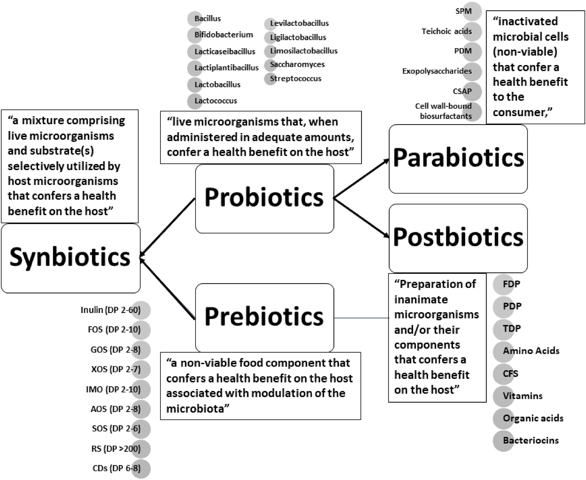

# Biology Zero

## Introduction

Mental wellness is an refelction of our body's microbial ecosystem, or we can say it other way around, it is a mutual reflection in both way.&#x20;

In order to improve our mental state as well as physical wellness, we can work with building a new neural circuit in our brain, an also try to optimize the microbiome inside the body.&#x20;

> Although glucocorticoids influence metabolic and immune processes and adapt the organism to changing demands \[[20](https://pmc.ncbi.nlm.nih.gov/articles/PMC8143481/#B20-healthcare-09-00494)], chronic and high stress-induced levels of glucocorticoids can be considered suppressive. Their biological role, however, remains unclear \[[19](https://pmc.ncbi.nlm.nih.gov/articles/PMC8143481/#B19-healthcare-09-00494)]. Under chronic stress, the HPA system is dysregulated which may result in pathophysiological changes and an increased risk for the development of various types of disorders including depression, Cushing syndrome, obesity, diabetes, hypertension, atherosclerosis, osteoporosis, and immune dysfunction \[[21](https://pmc.ncbi.nlm.nih.gov/articles/PMC8143481/#B21-healthcare-09-00494),[22](https://pmc.ncbi.nlm.nih.gov/articles/PMC8143481/#B22-healthcare-09-00494),[23](https://pmc.ncbi.nlm.nih.gov/articles/PMC8143481/#B23-healthcare-09-00494)].&#x20;

These common disease expressed in our society as a pattern of behavior, a mindset, and is communicated through the food we consume, people we encountered with, society we live in, as part of the reflection of our inner thoughts and subconsciousness. In addtion, our body and mind inherit the patterns from our ancestral bloodline, as inheriditary disease or genetic abnormality.&#x20;

We can create a new ecosystem loop as a purpose of evolution.

## Probelm&#x20;

> Individuals with low resilience might show life-long mental disorders or relatively severe acute responses to negative stressors. e

Mental disorder influences in gut-brain axis, in the consequence of microbial ecosystem disorder.

## GMO

**Production of Short-Chain Fatty Acids (SCFAs):** SCFAs, such as butyrate, acetate, and propionate, are produced by beneficial gut microbes and have anti-inflammatory and gut-healing properties. Engineering probiotics to produce more SCFAs would promote a healthier gut environment.

* _Gene Targets:_ Genes involved in the production of SCFAs, such as **butyryl-CoA:acetate CoA transferase (butyryl-CoA transferase)** for butyrate production.
* _Mechanism:_ The probiotic would metabolize dietary fibers to produce SCFAs, particularly butyrate, which nourishes colonocytes (gut epithelial cells), enhances the gut barrier, and reduces inflammation.
* _Example Organism:_ **Faecalibacterium prausnitzii** (butyrate producer) or **Bifidobacterium spp.** known to produce SCFAs.

**How It Works:** The engineered probiotic would enhance the production of SCFAs, which could not only provide nourishment to gut cells but also foster an anti-inflammatory environment in the gut. This would help prevent the imbalance of gut microbiota and inflammatory responses typically caused by stress.

<figure><figcaption></figcaption></figure>

"genetically modifying microbes to optimize the gut microbiome in response to stress is a promising but complex field. It involves genetic engineering, microbiome analysis, and personalized interventions to restore balance and enhance resilience. However, safety, efficacy, and ethical considerations must be carefully addressed as research progresses."

## References:






