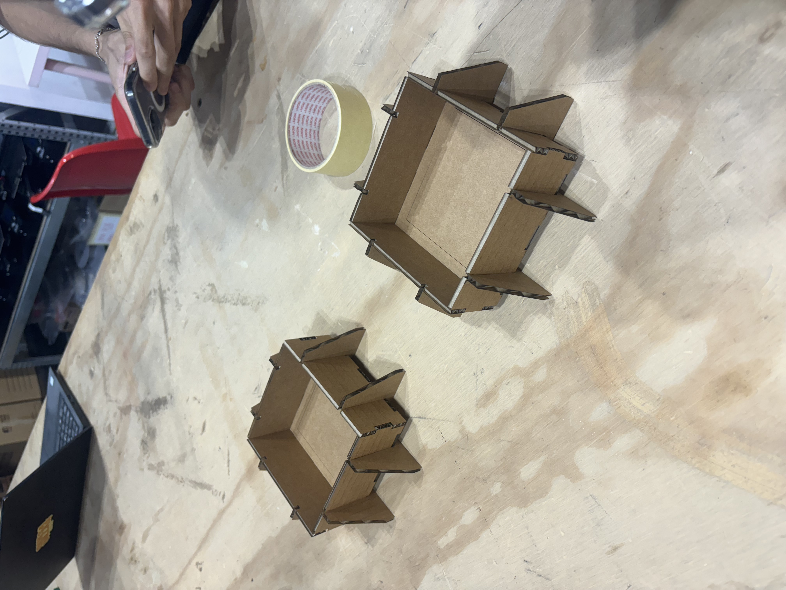
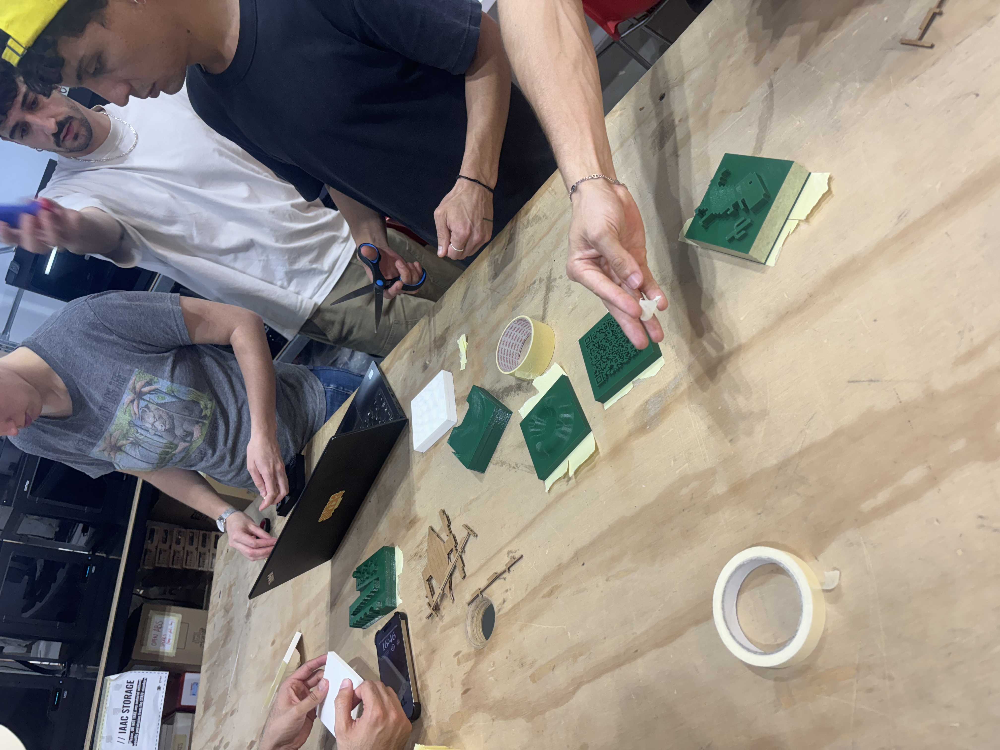

# Fundamentals of Digital Fabrication

Laser cutting the paper board for silicon molding

<figure><figcaption></figcaption></figure> <figure><figcaption></figcaption></figure> <figure><figcaption></figcaption></figure> <figure><figcaption></figcaption></figure>

Mixing silicon and finishing the molding

<figure><figcaption></figcaption></figure> <figure><figcaption></figcaption></figure> <figure><figcaption></figcaption></figure> <figure><figcaption></figcaption></figure>

<figure><figcaption>
our model
</figcaption></figure>

For casting we want to use organic material, so we develop a new ingredient based on paper clay. The following is the ingredient:

1. Coffee grind
2. Flour
3. Paper (soak in water)
4. Salt
5. Stick rice powder (as glue)

<figure><figcaption>
sticky rice powder
</figcaption></figure> <figure><figcaption>
wet paper
</figcaption></figure> <figure><figcaption>
adding coffee grind
</figcaption></figure> <figure><figcaption>
the dough
</figcaption></figure>

<figure><figcaption>
Waiting for it to dry
</figcaption></figure>

