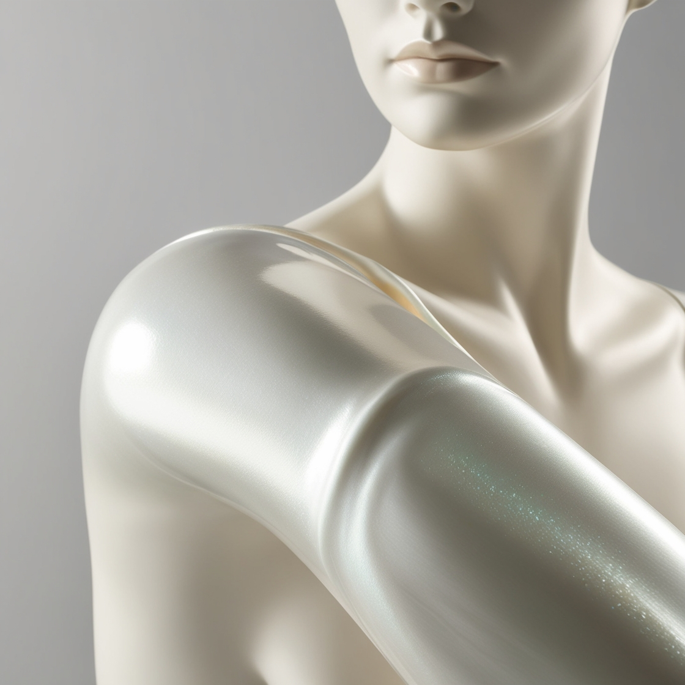
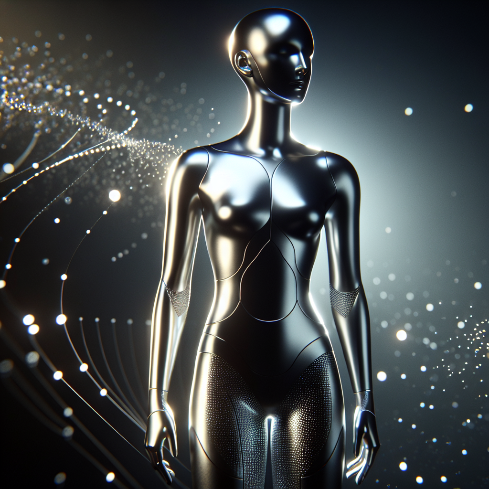
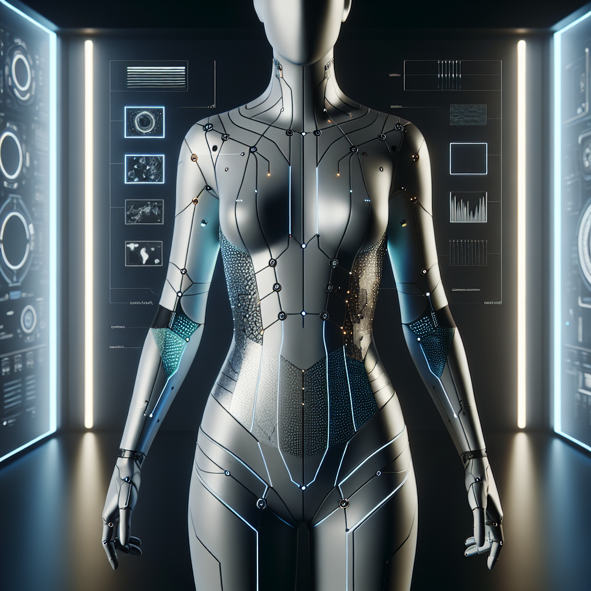
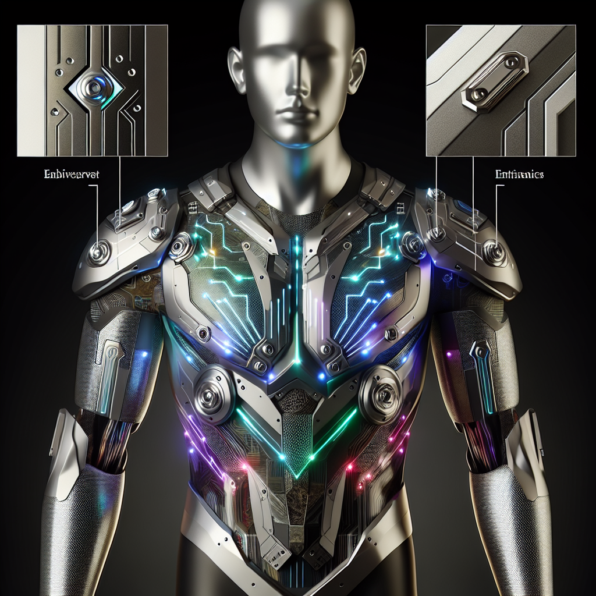

# Extended Intelligences II

## Modmatrix tryout

<figure><figcaption>
Modmatrix re-modifying
</figcaption></figure> <figure><figcaption>
the picture i used
</figcaption></figure>

<figure><figcaption>
3rd attempt for request of minimalistic
</figcaption></figure> <figure><figcaption>
2nd attempt
</figcaption></figure> <figure><figcaption>
1st attempt
</figcaption></figure>

***

## DOTTOD tryout

<figure><figcaption></figcaption></figure>

we tried to merge a photo of a real person with simple line flower grafiti on the background into the real world, this is the closest one from our prompt.

***

## Reflection

It was interesting to try modmatrix. It felt like closing the loop of using AI, and helped me understand what is AI really understanding.&#x20;

***

## Project: Read the room

We (Lucretia, David and me) decide to use the analog read from the light and temperature sensor on Barduino, using AI to analyse the data in order to play different tones with the buzzer to define a mood for the room.

Thanks to Chris and Pietro so we already have the code for the Barduino to connect to WIFI. We set up four tones (happy, sad, ambient, excited). However, we didn't manage to let AI play the tone that we want it to play, the tone is not changing when the data of the light changes. The connection to WIFI keeps reboosting. On Lucretia's laptop, Barduino only plays the tone in order everytime it reboosts. The problem might be how we write our prompt.

Even though our project didn't work, I like adding Barduino with AI, becasue there is so many possibilities. I don't know if there is still language barriers in AI (since on DOTTOD, AI also didn't quite understand our expression), or it's our coding problem, I would bring this thought of working with AI in coding to my daily life. Because I would like to explore using AI in environmental sensing and apply it into live performances.

