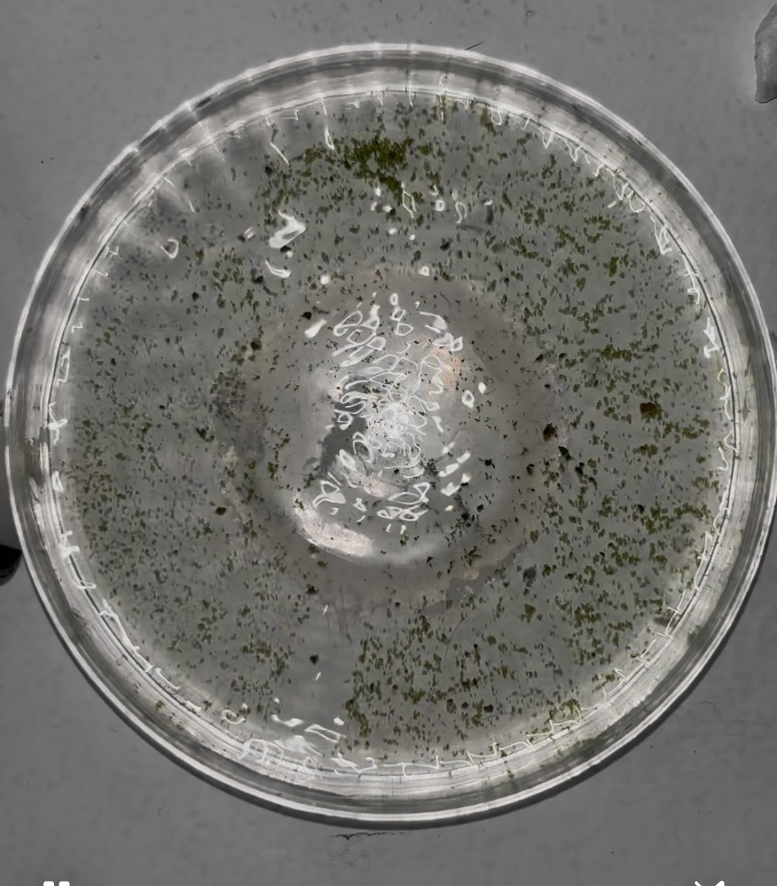

# Human-microenvironment interaction

<figure><figcaption></figcaption></figure>



For this microchallenge, we wanted to explore more-than-human interactions, diving into the concept of interspecies collaboration. Specifically, we’re interested in the speculative exchange between human input and water inhabited by living organisms.

The interaction unfolds in a loop, beginning with a human input via the heart rate sensor. This triggers two vibrating sensors attached to a Petri dish filled with water, causing the water to move in patterns based on the heart rate’s rhythm.

These movements are captured through a microscope connected to a computer, where the images are analyzed in TouchDesigner. The system identifies key features and maps them out, creating a matrix of coordinates, which is then translated into sound.



Maria Vittoria Colombo:[https://colombomariavittorias-organizati.gitbook.io/maria-vittoria-colombo-mdef](https://colombomariavittorias-organizati.gitbook.io/maria-vittoria-colombo-mdef)

Kevin Enriquez: [https://mdef02-kevin-enriquez.gitbook.io/mdef02-kevin-enriquez](https://mdef02-kevin-enriquez.gitbook.io/mdef02-kevin-enriquez)

Ziming Shang: [https://smuzs-organization.gitbook.io/smuz-mdef](https://smuzs-organization.gitbook.io/smuz-mdef)

Belen Comotto: [https://belcomotto.xyz/](https://belcomotto.xyz/) 



FABRICATION AND ITERATION PROCESS: 
--------------------------------------

<figure><figcaption></figcaption></figure>

Along the way of the development and testing of the working of the prototype we tested several different zooms from the microscope, different vibration intensities and different mediums of water with microorganisms. In the end we concluded that the best outcome resulted from using a mixture of different origins of the water, medium intensity vibration (150 / 255), and 10x magnification from the microscope. These parameters provided a clear enough visual from the camera sensor that would be usable in the TouchDesigner file.&#x20;

## Sensors:

We conducted numerous tests with different sensors and Petri dishes to achieve the best results. We experimented with vibrating motor, speakers, and piezo parts. The vibrating motors, placed on the sides of the Petri dish, provided the most consistent performance. To optimize vibration, we chose a plastic Petri dish and placed it on a silicone base.

Similarly, with the heart rate sensor, we tested various setups, adjusting values and coding repeatedly. However, the results were often imprecise and unreliable, so we decided to switch to a finger-based sensor for better accuracy (v1706 heart beat sensor).

## Touchdesigner:

We used Python code with the OpenCV plugin in TouchDesigner to apply computer vision, detecting edge points in the video, as well as blob tracking. From these points, we extracted a dataset of x and y coordinates, which we translated into sound by mapping them across four layers of audio oscillators, each using different waveforms and frequencies. This process generated the final audio output.

## Water:

We analyzed three different types: stagnant puddle water, seawater, and water from a public park. Each sample revealed distinct elements, which we identified and visualized using TouchDesigner’s features.

## Wearable:

We also decided to create a wearable, gelatin-based biomaterial infused with spirulina for coloring. We crafted a rectangular sheet of this material to integrate with the sensor.

Recipe: 100g gelatin, 60g alginate, 550ml water — bring to a boil, then pour into a mold. Add spirulina for pigmentation.

The concept was to design a sort of colletto like structure — allowing the biomaterial to hold the sensor against the neck

 

\
 

 
