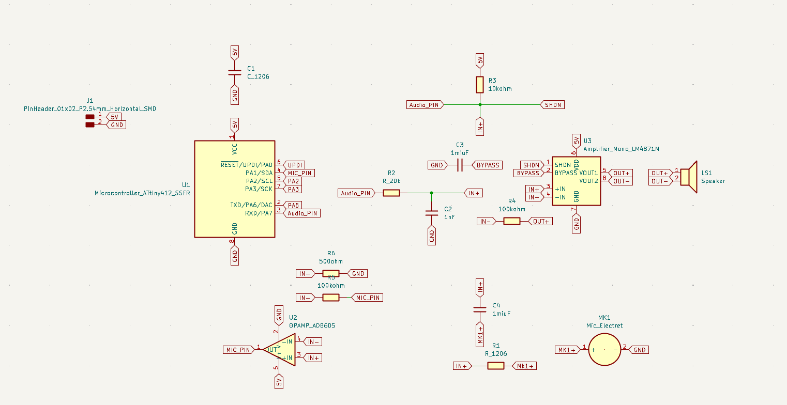
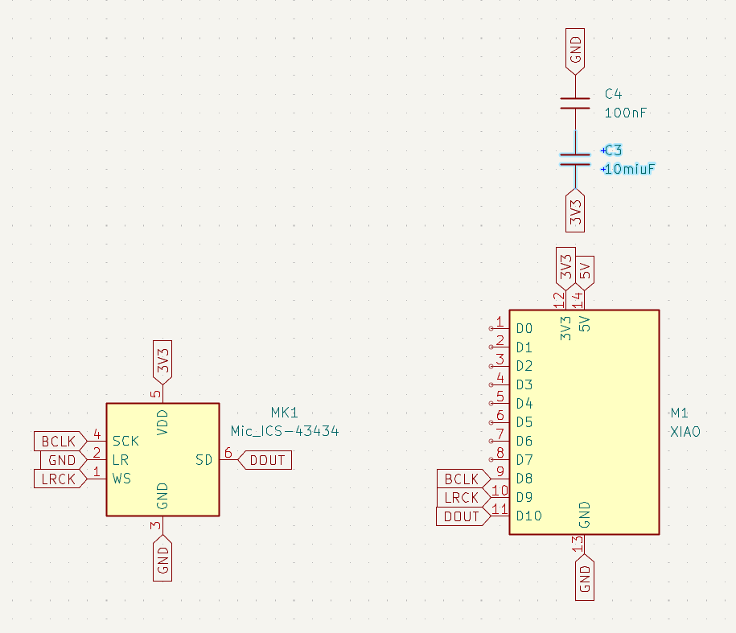

# Electronic Design

## Index



#### Reading Material



### <kbd><mark style="color:purple;">Basic of electricity<mark style="color:purple;"></kbd>

In order to understand how to design electric circuit to fabricate a board, we need to learn from the basics of how energy and electricities works and how to calculate the voltage to make the electricity flow.

In general, my understanding of how to design a electric board is to determine the purpose of the board and using different components that can help electricity flow, sending power through cycle to accomplish an electricity loop.

Electricity is about how the atomic structure (protons, electrons), their charge interact with each other. The conducticity of materials is depend on how freely can the electrons move throught the atomic lattice. The movement of electrons in a conductor is slow, but the electric field propagates very fast which is close to light speed, so that electrical effects can occur instantly.

#### <kbd><mark style="color:$primary;">Fundamental quantities to describe how electronic circuits behave<mark style="color:$primary;"></kbd>

**Current (I)**— The flow of the charge

**Voltage (V)**— the electromotive force that pushes charges

**Resistance (R)**— how much a component opposes current

**Capacitance (C)**— how energy can be stored

**Inductance (L)**— how these elements affect circuit behavior differently depending on frequency

The basic equation is&#x20;

<h3 align="center">V=I*R</h3>

This function help us to calculate which resistor to use and to chech the electricity flow using the meters.

#### <kbd><mark style="color:$primary;">Transistor<mark style="color:$primary;"></kbd>

Transistors act as tiny electronic switches or amplifers by controling the flow of charge between terminals using electrical fields.

#### <kbd><mark style="color:$primary;">Diodes<mark style="color:$primary;"></kbd>

Diodes are the components that let current flow easily in on direction but block it in the other. It shows how this simple behavior can be used in practical circuits.&#x20;

It can be used as rectifying AC to DC, protecting circuits from reverse voltage, clamping voltage levels, and signal demodulation.

***

#### <kbd><mark style="color:$warning;">Hands-on learning<mark style="color:$warning;"></kbd>

<figure><figcaption></figcaption></figure>

We learned the circuit from how to draw a diagram into build it by hand to understand it. We use power bank of 5V for power supply, and connect a LED with a switch, which can turn it on by pressing it, with a resistantor to control the flow of current so that the electricity will not burn the cuircuit and the LED.

By using the multimeter from A to B, B to C, we can calculate how much resistor we can use.

#### Example in class

On Kicad, first we need to design the schematic of the PCB.

We can find the components with ctrl + A

By understanding each component by reading the datasheet, we need to match each pin to each other.

<figure><figcaption></figcaption></figure>

<figure><figcaption></figcaption></figure>

***

### Homework

#### Designing a PCB with an microphone as input, and an amplified speaker as output



At first I choose to use eletrect microphone-->Amplifier-->ATiny412-->Amplifier-->Speaker, but the chip is too small to be fabricated in FabLab. As the suggestion from Dani, I change it to [Adafruit I2S MEMS Microphone Breakout - ICS-43434 PCB](https://github.com/adafruit/Adafruit-I2S-MEMS-Microphone-Breakout-PCB?tab=readme-ov-file)-->[XIAO ESP32S3](https://wiki.seeedstudio.com/xiao_esp32s3_pin_multiplexing/)-->Adafruit I2S Amplifier

The first version was very complicated

<figure><figcaption></figcaption></figure>

with Adafruit I2S connecting to XIAO ESP32S3 everything got simplified

<figure><figcaption></figcaption></figure>

The PCB editor is like this

<figure><figcaption></figcaption></figure>



Adafruit I2S Amplifier will connect directly to XIAO ESP32S3
